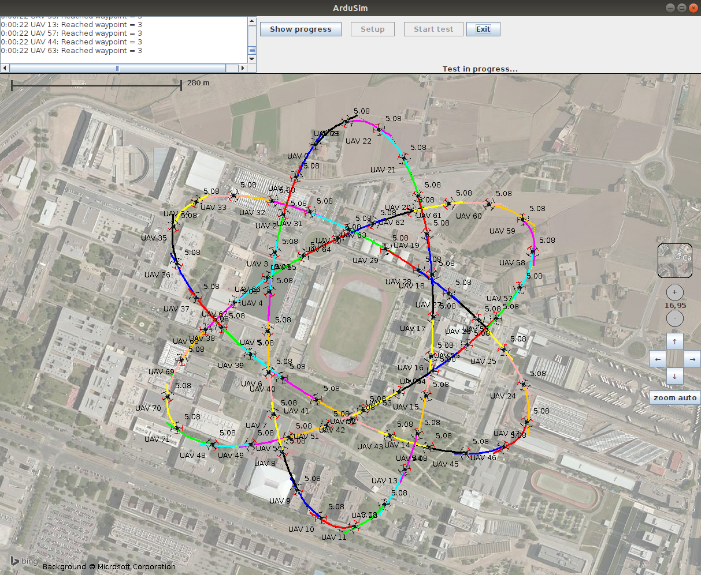

# ArduSim

ArduSim is a novel real-time flight simulator, oriented to the development of flight coordination protocols for multicopters, performing planned missions or forming a swarm. It is able to simulate up to multiple UAVs (aka. drones) simultaneously, the number of UAVs that can be simulated are mainly restricted by the PC that is used. ArduSim simulates a wireless Ad-hoc network for UAV-to-UAV communications. Among many information, ArduSim generates the path followed by each UAV in OMNeT++ and NS2 format to provide mobility traces, performing a simulation or even when running ArduSim in a real multicopter.

The communication with multicopters uses the MAVLink protocol, a *de facto* standard for current open flight controllers, which makes the deployment of a new protocol on real UAVs a trivial task.

The communication among multicopters emulates an Ad-hoc WiFi network link in the 5 GHz frequency band, where all the data packets are broadcasted. ArduSim is prepared to include new wireless models in future versions.

Ardusim was developed by Francisco Fabra, at that time a Phd student in the [Grupo de Redes de Computadores (GRC)](http://www.grc.upv.es/) research group of [Departamento de Informática de Sistemas y Computadores (DISCA)](http://www.upv.es/entidades/DISCA/index-es.html) department of [Universitat Politècnica de València](http://www.upv.es/) university. Supervisor: [Carlos T. Calafate](http://www.grc.upv.es/calafate/). Currently it is maintained by [Jamie Wubben](mailto:jwubben@disca.upv.es) under the same affiliation  and the same supervisor.

As an example of the capabilities of ArduSim, the next picture shows 72 multicopters following elliptical missions like electrons of an atom. The background image is built with Bing Maps. You can use Open Street Maps, or Bing images. The later requires to put a valid user key in `ardusim.ini` file, which can be obtained for free with any Microsoft account following this [link](https://docs.microsoft.com/en-us/bingmaps/getting-started/bing-maps-dev-center-help/getting-a-bing-maps-key).

We highly recommend to read the full documentation at least once before starting a new protocol.

## Table of contents

[ArduSim setup](#markdown-header-ardusim-setup)

[Protocol development](#markdown-header-protocol-development)

[ArduSim usage](#markdown-header-ardusim-usage)

[Deployment on real devices](#markdown-header-deployment-on-real-devices-raspberry-pi-3-b)

[Citation](#markdown-header-citation)

[Copyright information](#markdown-header-copyright-information)

## ArduSim setup

ArduSim supports running on Windows, Linux, and MacOS. Follow [this link](help/setup.md) for detailed instructions.

## Protocol development

Follow [this link](help/development.md) for detailed instructions.

## ArduSim usage

Follow [this link](help/usage.md) for detailed instructions.

## Deployment on real devices - Raspberry Pi 3 B+

You can deploy the implemented protocol on real UAVs just changing the ArduSim execution parameters, as explained in the [previous section](help/usage.md).

Follow [this link](help/deployment.md) for detailed instructions.

## Citation

The article *[ArduSim: Accurate and real-time multicopter simulation](https://doi.org/10.1016/j.simpat.2018.06.009)* was published in the journal [Simulation Modelling Practice and Theory (SIMPAT)](https://www.journals.elsevier.com/simulation-modelling-practice-and-theory) detailing most characteristics of ArduSim and validating its performance. Since then, many improvements have been made, including traces output in OMNeT++ and NS2 format.

If you plan to use ArduSim in your projects, please cite this repository and the journal article.

## Copyright information

ArduSim is published under [Apache License 2.0](https://www.apache.org/licenses/LICENSE-2.0). Some third part libraries were used and are under their own license as detailed:

[ArduPilot](https://github.com/ArduPilot/ardupilot) is the single UAV simulator ArduSim is based on, and is built under the [GNU General Public License v3.0](https://github.com/ArduPilot/ardupilot/blob/master/COPYING.txt).

MAVLink libraries are used to communicate with real or virtual flight controller in native language and are built with [MAVLink Java generator and library](https://github.com/ghelle/MAVLinkJava) tool. [MAVLink message definition XML files](https://github.com/mavlink/mavlink/tree/master/message_definitions) are under the MIT-licence.

The AtomicFloat implementation comes from Makoto YUI and under [Apache license](http://www.apache.org/licenses/LICENSE-2.0).

The AtomicDoubleArray implementation comes from Doug Lea and under [CC0 1.0 Universal license](http://creativecommons.org/publicdomain/zero/1.0/), and is based on [Guava](https://github.com/google/guava) from Google, which is under [Apache license](https://github.com/google/guava/blob/master/COPYING).

The VerticalFlowLayout implementation comes from Vassili Dzuba and under [Artistic License](https://opensource.org/licenses/artistic-license-2.0).

[Kryo library](https://github.com/EsotericSoftware/kryo) is used to serialize transferred data and under [BSD 3-clause license](https://github.com/EsotericSoftware/kryo/blob/master/LICENSE.md), and requires three [libraries](https://github.com/EsotericSoftware/kryo/tree/master/lib): [minlog](https://github.com/EsotericSoftware/minlog) and [reflectASM](https://github.com/EsotericSoftware/reflectasm) under the same license, and [objenesis](http://objenesis.org/license.html) under [Apache license](http://www.apache.org/licenses/LICENSE-2.0).

[javatuples](https://www.javatuples.org/) is used to return multiple values on functions and under [Apache license](https://www.javatuples.org/license.html).

[jSerialComm](https://github.com/Fazecast/jSerialComm/wiki) is used to communicate with a real flight controller through serial port and under [LGPL v 3.0 license](https://github.com/Fazecast/jSerialComm/blob/master/LICENSE-LGPL-3.0) and [Apache license](https://github.com/Fazecast/jSerialComm/blob/master/LICENSE-APACHE-2.0).

Statistical Machine Intelligence and Learning Engine ([Smile](https://github.com/haifengl/smile)) is used for the protocol Chemotaxis (core, data, interpolation and math modules) and under [Apache license](https://github.com/haifengl/smile/blob/master/LICENSE).

[Sigar](https://github.com/hyperic/sigar) is used to measure CPU ussage under Windows and is under [Apache license](https://github.com/hyperic/sigar/blob/master/LICENSE).
