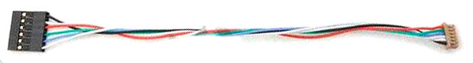
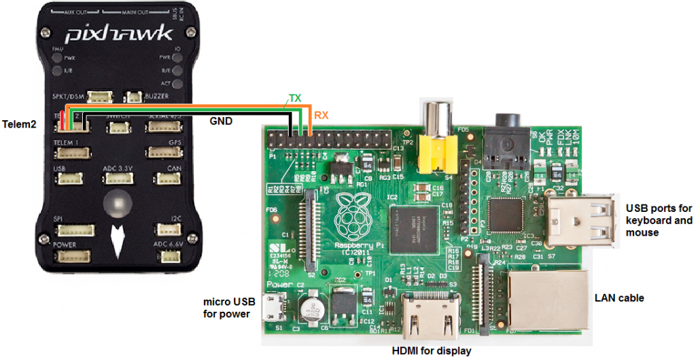

# Deployment on real devices - Raspberry Pi 3 B+

The first deployment of a protocol requieres to configure hardware and software of one or more real multicopters. On later deployments, it will be enough to copy some files to the Raspberry Pi 3 B+ as detailed in [this link](setup.md).

You are supposed to previously own a Pixhawk controlled multicopter, and a Raspberry Pi 3 B+ with Raspbian OS to be attached to it (tested on Raspbian Stretch with desktop, release date 2018-06-27).

## Table of contents

[Hardware setup](#markdown-header-1-hardware-setup)

[Software setup](#markdown-header-2-software-setup)

## 1 Hardware setup

### 1.1 Raspberry - Pixhawk serial link

ArduSim communicates with the flight controller through a serial port, so we need to stablish a connection between them.

A Pixhawk controller has two telemetry ports, one tipically used for a telemetry wireless transmitter and another available for other purposes. On the other hand, a Raspberry Pi 3 B+ has a 40 pins GPIO where we can connect the telemetry port as a serial 3.3V link, with a cable similar to the one shown on the next image, which would need modifications following the instructions in this [link](http://ardupilot.org/dev/docs/raspberry-pi-via-mavlink.html). Use that guide as a reference and connect the cable as shown in the image below.

### 1.2 Wireless ad-hoc network

Regarding the communication among multicopters, we need to create an Ad-hoc network among them.

On a previous work ([On the impact of inter-UAV communications interference in the 2.4 GHz band](http://ieeexplore.ieee.org/document/7986413/)), we found that most of the remote controls available in the market jam the 2.4 GHz frequency band, so it is convenient to use the 5 GHz band on the Raspberry Pi 3 B+. If you plan to use a previous version of Raspberry Pi, then you would have to use an external adapter capable of running in Ad-hoc mode in the 5 GHz band.

## 2 Software setup

### 2.1 ArduCopter firmware configuration

The default configuration of the multicopter firmware is not ready to work with ArduSim, so you need to change some parameters using *[Mission Planner](https://ardupilot.org/planner/)* or *[APM Planner](https://ardupilot.org/planner2/)*. The link to communicate with the Raspberry Pi is the Serial 2 (telem2). Now follows the list of parameters to be modified, and the recommended values. The first group, SR2_EXT_STAT, and SR2_POSITION must be set to the indicated values, while the remaining parameters are optional. The second group values represent the number of messages per second that the Raspberry Pi will receive.

Parameter | value
--- | ---
SERIAL2_BAUD | 57 (equivalent to 57600 bits per second)
SERIAL2_OPTIONS | 0
SERIAL2_PROTOCOL | 1 (Mavlink v1. In future releases it will be set to 2 to use Mavlink v2)
--- | ---
SR2_ADSB | 5
SR2_EXT_STAT | 2 (required to receive battery statistics)
SR2_EXTRA1 | 5
SR2_EXTRA2 | 2
SR2_EXTRA3 | 3
SR2_PARAMS | 0
SR2_POSITION | 2 (required to locate the multicopter)
SR2_RAW_CTRL | 0
SR2_RAW_SENS | 2
SR2_RC_CHAN | 5

### 2.2 Raspberry Pi - Pixhawk serial link

Raspbian, the Raspberry Pi operating system, may be using the serial port by default for the standard output, so it would send a lot of useless data to the flight controller. To avoid this, we have to keep the serial port enabled while disabling the output. Open the GUI tool in "Preferences-->Raspberry pi configuration", and enable "Serial Port" and disable "Serial Console" in the "Interfaces" tab. Alternatively, you can use the console utility with the following commands, go to *"Interfacing Options" - "Serial"* and enable it, but then you must check the file */boot/cmdline.txt* after reboot and remove the text *"console=serial0,115200"* if found.

    sudo apt-get update
    sudo raspi-config

Finally we have to enable the **ttyAMA0** serial port, which is disabled by default on the Raspberry Pi model 3 to be able to use the bluetooth output through the GPIO connector (not in previous versions), so we need to swap serial and bluetooth ports. Edit the file */boot/config.txt/* and add this two lines (the first one could already be there):

    enable_uart=1
    dtoverlay=pi3-miniuart-bt

Alternatively, you can completely disable bluetooth with this overlay:

    dtoverlay=pi3-disable-bt

Next, restart the device and check that the *ttyAMA0* port is available again with the next command (a line must show: *serial0 -> ttyAMA0*):

    ls -l /dev

Finally, restart the Raspberry pi 3 B+ for the changes to take effect.

### 2.3 Wireless ad-hoc network

1. Check the regulatory region used for the WiFi adapter and allowed frequencies:

        iw reg get (shows current limitations and the country set)
        iwlist wlan0 channel (shows allowed frequencies)

    One or both commands will show the limitations on different frequency ranges. You are not allowed to do an Ad-hoc network on a specific frequency if a text like *"no-IBSS"* appears.
    
    If your current region is applied and it is forbidden to stablish an Ad-hoc network in the 5 GHz frequency band you should use the 2.4 GHz band. Otherwise, if your region is not applied, you must change it with the *Raspberry Pi Configuration*  tool, on the tab *Localisation*, option *set wifi region*, and then restart the device.

2. Network configuration. Raspbian Jessie and Stretch have changed the way a network is configured. The file */etc/network/interfaces* must remain untouched. Please, generate the file */etc/network/interfaces.d/wlan0* with the following content:

        auto wlan0
        iface wlan0 inet static
        address 192.168.1.2
        netmask 255.255.255.0
        wireless-channel 36
        wireless-essid NETWORK_NAME
        wireless-mode ad-hoc

    Now edit the file */etc/dhcpcd.conf* and add the following command at the end of the file:
    
        denyinterfaces wlan0

    Finally restart the Raspberry Pi. This way we leave the loopback interface untouched, and ethernet connection under DHCP control. We use a static address for the network named *NETWORK_NAME*. You also have to change the network address for each multicopter used in the group/swarm. We have found that the network manager makes a mess and thinks that the regulatory domain (WiFi country) is unset when using Raspbian in desktop mode. Don't care about it, as you can check, the Ad-hoc network is up and functioning once you restart the device (network manager becomes useless).

    Maybe you are using other wireless adapters. If this is the case, we found that Raspbian changes randomly the wireless adapter identifier when using more than one at the same time. This issue could prevent ArduSim from working adequately sometimes. To solve it, you have to fix the adapters identifier editing the file */lib/udev/rules.d/75-persistent-net-generator.rules* and replace the corresponding line with:

        KERNEL!="eth*[0-9]|ath*|wlan*[0-9]|msh*|ra*|sta*|ctc*|lcs*|hsi*", \

    Then, unplug the external adapter and restart the device, and when it has fully booted plug in the  external adapter. /etc/udev/rules.d/70-persistent-net.rules should be created with definitions for persistent rules for wlan0 and wlan1. Now check that the configuration already set in this chapter is applied to the correct wlanX adapter.
    Test the ad-hoc network by pinging to another device in the network. We have found that sometimes the wireless-channel is not accepted, if the devices are unable to communicate with each other this is most likely the problem. It can be easly fixed by changing the channel to another one. Use iwconfig to get more information and to change the channel rapidly. If the channel is not accepted it will return a invalid parameter error, once a channel is found that works on all devices make the necessary changes in the file */etc/network/interfaces.d/wlan0* and reboot the system.  
    
### 2.4 Java

By default, the latest version of Raspbian comes with OpenJDK 11 o greater, so ArduSim should work out of the box. Otherwise, you should install Java 11 o greater.

### 2.5 ArduSim autostart

You can start ArduSim with a remote SSH connection from a computer once the multicopter and the Raspberry Pi 3 B+ are turned on, but it is more practical to start ArduSim automatically on the Raspberry startup. To do so, we wrote a simple service (*ardusim.service*) with the following content:

    [Unit]
    Description=ArduSim
    After=network-online.target
    Wants=network-online.target
    
    [Service]
    Type=oneshot
    RemainAfterExit=true
    ExecStart=/usr/lib/jvm/java-11-openjdk-armhf/bin/java -jar /home/pi/Desktop/ArduSim.jar multicopter
    WorkingDirectory=/home/pi/Desktop/
    StandardOutput=syslog
    StandardError=syslog
    SyslogIdentifier=ardusim
    Restart=no
    User=pi
    
    [Install]
    WantedBy=multi-user.target

ArduSim is supposed to be in the Desktop folder, besides the file *ardusim.ini*, which contains the needed parameters to run ArduSim.

This service allows us to execute the application and, at the same time, shows and stores the standard output in a file. It waits the network to be configured and runs ArduSim with the protocol indicated in *ardusim.ini*.

To store the console output of ArduSim to a file, we also need to specify the target file to the system log service. Create the file */etc/rsyslog.d/ardusim.conf* with the following content:

    if $programname == 'ardusim' then /home/pi/Desktop/ArduSim.log
    if $programname == 'ardusim' then ~

Each time the service writes something to the stdout or sterr, it will be redirected to the specified file. To enable modifications restart the logging service:

    sudo systemctl restart rsyslog.service

Next, copy the service file and test it to be sure that it is working:

    sudo chmod 644 ardusim.service
    sudo cp ardusim.service /etc/systemd/system/ardusim.service
    sudo systemctl daemon-reload
    sudo systemctl start ardusim.service

Restart the Raspberry Pi and check the content of the file */home/pi/Desktop/Ardusim.log* to be sure that the service is working fine. If the service fails or behaves unexpectedly, stop the service an repeat all the previous commands but the first, until the service works fine. Then, use the following command to enable the service on startup:

    sudo systemctl enable ardusim.service

Finally, restart the device and check the log file to be sure that ArduSim has started with the system. Don't forget to store a main.java.com.protocols.mission file beside ArduSim if the protocol under test requires it.