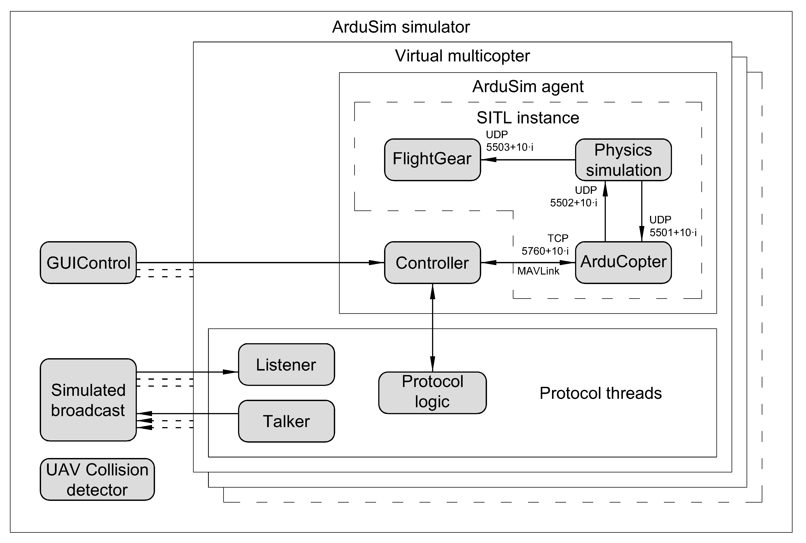
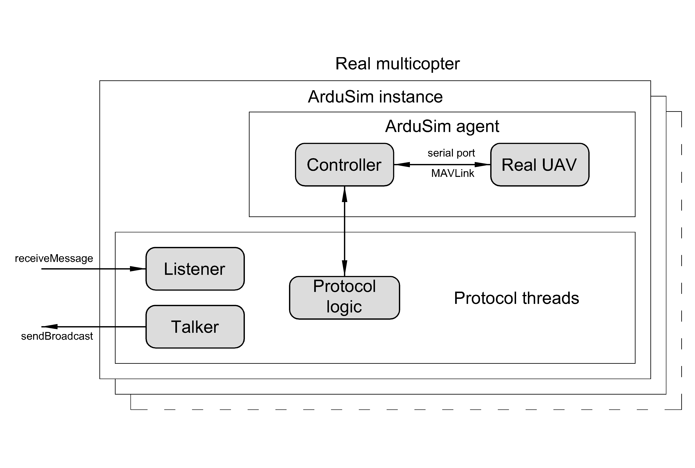

# Protocol development

This document explains in detail how to develop a new protocol in ArduSim.

## Table of contents

[1 ArduSim architecture](#1-ardusim-architecture)

[2 Packages structure](#2-packages-structure)

[3 Application workflow](#3-application-workflow)

[4 Protocol implementation](#4-protocol-implementation)

[5 Implementation details](#5-implementation-details)

## 1 ArduSim architecture

ArduSim is able to run performing four different roles:

* Simulator. The application runs on a PC and uses a SITL instance for each virtual multicopter that it simulates.
    * Simulator-GUI. Default parameters are read from .properties files, but most of them can be controled in the GUI. Useful for doing test when developing a protocol because it gives visual feedback.
    * Simulator-CLI. Default parameters are read from .properties files. Usefull when automating tests (for instance for AI or protocols that take a while). To vary the tests slightly you should create a script which (in a loop) alters the .properties files and runs ArduSim 
* UAV agent (multicopter). The application runs on a Raspberry Pi 3 B+ attached to a multicopter. The experiment is controlled from a PC Companion.
* PC Companion. The application runs on a Laptop and allows to control an experiment followed by any number of real multicopters.

The code needed to run the PC Companion is completed and needs no further modification. When the protocol developer follows the included [recomendations](#56-implementation-recomendations), the same code used for simulation is also valid for a real multicopter, which makes the deployment on real devices somewhat trivial. In order to make it possible, the multicopters are assigned a unique identifier (ID) based on their MAC address, or a number starting in zero if ArduSim behaves as a simulator.

### 1.1 Simulator

To simulate a great number of UAVs simultaneously, we have used the SITL application as a basic development module. SITL contains control code resembling a real UAV, simulating its physical and flying properties with great accuracy. A SITL instance is executed for each virtual UAV, and it runs together with its physical engine on a single process, as seen in the following image:



ArduSim relies on a multiagent simulation architecture that implements a high-level control logic above SITL itself.

ArduSim includes the simulation of packet broadcasting between UAVs (*Simulated broadcast*), and the detection of possible collisions (*UAV Collision detector*).

Each virtual multicopter is composed of an agent in charge of controlling the UAV behavior, and the different threads required for the protocol being tested. The communication between UAVs requires a minimum of two threads, one for sending data packets (*Talker*), and another one for their reception (*Listener*). Both communication threads are automatically blocked when the experiment finishes, it is, when the multicopters land. In any case, we recommend to keep the thread *Listener* listening for data packets continuously, as up-to-date packets could be discarded because the reception buffer fills up, and older packets would be used.

An ArduSim agent includes a SITL instance, and a thread (*Controller*) in charge of sending commands to the multicopter, and of receiving the information that it generates.

The protocol under development can run more threads to control the behavior of the multicopter, like *Protocol logic*, but it is highly recommended to control the multicopter from the thread *Listener* if the multicopter behavior depends on the information received from other multicopters, just to avoid any lag between the moment it receives information and the moment when the control action is applied.

### 1.2 UAV agent (multicopter)

The ArduSim simulator has been designed to facilitate the deployment of the implemented protocols in real UAVs.

When running ArduSim in a Raspberry Pi 3 B+, all the simulation-dependent software elements are disabled merely by changing an execution parameter, which makes the deployment of a newly developed protocol somewhat trivial.

The requirements to deploy on a real device are shown in the [Deployment on real devices - Raspberry Pi 3 B+](deployment.md) section.

The following image shows the architecture of the application when running on a real device.



If the threads of the protocol are programmed following the recomendations, the deployment is trivial, as the architecture remains the same.

Two new threads (*Test Listener* and *Test Talker*) communicate with the PC Companion. When commands to start the setup step or the experiment are received from the PC Companion, the thread *Test Listener* sends to the flight controller the appropriate commands the same way the thread *GUIControl* does when performing a simulation.

## 2 Packages structure

The project in organized in packages, and follows the [Standard Directory Layout] (https://maven.apache.org/guides/introduction/introduction-to-the-standard-directory-layout.html) of Maven.. We suggest to enable the hierarchical presentation of packages in your IDE to easily understand the project structure, which includes the following high level packages:

* **ArduSim**: Folder of the project.
   * **Help**: Documentation Files that you are reading at the moment.
   * **local-maven-repo**: Includes a .jar with basic funcionality for ArduSim, such as drawing on the screen, etc.
   * **src**: All source files
      * **main**
         * **Java**: all Java code
         * **resources**: Files suchs as .fxml and parameter files
      * **test**: follows the same sturcture as the Java folder but includes only (JUnit) tests.
   * **target**: includes important files and java .class files after compilation.
      * *arducopter*: SITL file for linux
      * *arducopter.exe*: SITL file for Windows
      * *ardusim.ini*: Parameter file for real experiments
      * *copter.parm*: Parameter file for ArduCopter
      * *speed.csv*: CSV file with speed for all the UAVs             

The source code package can be further divided into the following:
* **ArduSim.src.main.java.com.**: Source code
   * **api**: Code that can (and should) be used when developing a new protocol. All common things are present there suchs as: moving a UAV to a coordinate, creating a formation, communicating between UAVs, etc.
   * **protocols**: The procotol package holds folders for each indivual protocol. For maintenance it is important that each procotol stays completly isolated from the other protocols.
   * **setup**: This contains all the code of ArduSim (simulator/real) it self. Code in this package should only be touched by experience users of ArduSim, and should not be altered if you only want to develop a new protocol.
   * **uavController**: Inside of this package there exisits code to let ArduSim comunicate with (the various) ArduCopter instances. As with the code in the setup package, this code should only by touched by experience users. 

Each new protocol must be selfcontained in an independent package inside of the package *ArduSim.src.main.java.com.protocols*. This way, the protocol code will be fully independent from ArduSim code, making it easy to update ArduSim to a new version, and easily understandable for other programmers. It is only allowed to put files in a sub-package of the *resources* package, or in a sub-folder of the *libs* folder.

Several main.java.com.api.protocols have been already included in ArduSim:

* **Mission**. This protocol simply makes a group of multicopters to follow a planned mission.
* **MBCAP**. It avoids collisions among multicopters that are following a planned mission, as explained in the article [A Distributed Approach for Collision Avoidance between Multirotor UAVs Following Planned Missions](https://doi.org/10.3390/s19102404), presented in the journal "SENSORS".
* **MUSCOP**. It makes a swarm to follow a single mission stored in one of them (master), while keeping the formation stable. Furthermore, the takeoff of all the multicopters is safe until forming up in flight. Work being presented in the paper "An UAV Swarm Coordination Protocol Supporting Planned Missions", in conference "28th International Conference on Computer Communications and Networks (ICCCN 2019)". Newest update also allows failure of any swarm element. 
* **Follow Me**. A swarm follows a multicopter that is manually controlled by a pilot, as presented in the article [Automatic system supporting multicopter swarms with manual guidance](https://doi.org/10.1016/j.compeleceng.2019.01.026), presented in the journal "Computers and Electrical Engineering".
* **Vision** A single UAV equiped with a camera uses visual input to land on an Aruco-marker. The protocol makes a connection to a python script (available at https://github.com/dewub/vision_drone), this script handles all the image proccessing and ArduSim handles the movement of the UAV. More details are presented in the article [Accurate Landing of Unmanned Aerial Vehicles Using Ground Pattern Recognition] (https://doi.org/10.3390/electronics8121532), presented in journal MDPI electronics.  
* **shakeup** A protocol that allows a swarm of UAVs to reconfigure while reducing the change of collison. More details can be found in our article [Toward secure, efficient, and seamless reconfiguration of UAV swarm formations ](https://www.researchgate.net/publication/344266456_Toward_secure_efficient_and_seamless_reconfiguration_of_UAV_swarm_formations)
* **compareTakeOff** A protocol to compare various assignment algorithms in order to take off savely. 

Please, feel free to reuse code from any protocols while developing a new one. "Mission" is the better starting point for developing a protocol where all the multicopters must follow a planned mission, while "Follow Me" and "MUSCOP" are more adequate when developing a protocol for a swarm.

## 3 Application workflow

As explained in section "[1 ArduSim architecture](#1-ardusim-architecture)", ArduSim can be run performing three (four but simulation GUI and CLi behaves similar) different roles. The next diagram shows the timeline of ArduSim execution since it is started until if finishes.

Rectangular boxes represent the functions included in section "[4 Protocol implementation](#4-protocol-implementation)" that must be implemented by the developer, while comments are automatic processes performed by ArduSim. These functions are included in the ProtocolHelper.java class that the developer must extend in order to implement a new protocol.


ArduSim starts loading the implemented protocols and parsing the command line to know which role it will run.

### 3.1 PC Companion

First of all, communications are set online. Then, when the user presses the "Setup" button the command is issued and the detected real multicopters execute the `setupActionPerformed()` method. Once the setup process is completed, the user can start the experiment with the corresponding button, and the multicopters execute the method `startExperimentActionPerformed()`. Immediately, if the developer needs it, a dialog can be opened with the function `openPCCompanionDialog()` where the user could analize the data packets sent among the multicopters.

At any moment, the user can start actions to take control over the multicopters if the protocol behavior is unexpected, like land or return to the launch location (RTL).

### 3.2 UAV agent (multicopter)

ArduSim assigns an unique ID to the multicopter and then loads the planned mission from a file (`loadMission()`), if the protocol needs it. Then, the method `initializeDataStructures()` is launched, where the developer can initialize the variables needed by the protocol taking into account the number of multicopters being run in the same ArduSim instance (one in this case, but many for simulations).

The logging of the path followed by the multicopter is started and the application sends some configuration to the flight controller and waits until the multicopter is located by the GPS system. Next, the planned mission (if any) is automatically sent before executing the function `sendInitialConfiguration()`. This function can be used to retrieve more information from the UAV, or send commands to it before starting the threads of the protocol with the function `startThreads()`. We recommend to retrieve any needed UAV configuration before starting the threads in the previous function. Please remember that the threads are started here, but they execution probably must wait until the user presses the "Setup" and/or "Start" buttons, when the functions `setupActionPerformed()` and `startExperimentActionPerformed()` are run. This can be achieved with the functions explained in section "[5.4 ArduSim integration](#54-ardusim-integration)". They are solely enough to coordinate the threads with ArduSim.

The experiment is finished when the multicopter lands and the motors stop. Some protocols will land the UAV automatically, but others could finish while the UAV is flying, like *MBCAP*. In the second case, the function `forceExperimentEnd()` must be implemented to detect the end of the experiment and land the multicopter.

Once the experiment is finished, the methods `getExperimentResults()` and `getExperimentConfiguration()` allow the developer to generate Strings with general information and configuration of the protocol that will be included in the default log files. Additionally, the method `logData()` can be used to store files with more information.

### 3.3 Simulator

The most important difference between "*UAV agent*" and "*Simulator*" roles implementations is the number of multicopters that run in the same machine, one in the former and several in the later. It is highly suggested to store data in array variables with the length of the number of UAVs that run in the machine, so in the real UAV the array length will be 1, and the code will be valid for both roles (see section "[5.6 Implementation recomendations](#56-implementation-recomendations)"). Good implementation examples can be found in "MBCAP" and "MUSCOP" protocols. A function is provided to know which ID (multicopter) corresponds to a specific position in the array. This function will provide the ID of the multicopter when running on a real UAV, when the array has a length of 1. On the other hand, no function is provided to get a UAV location in the array given the ID, as it will always be 0 in the real UAV, and in simulation the ID is equivalent to the position in the array.

When ArduSim is run as Simulator-GUI, it also checks if the computer meets some requirements and opens a general configuration dialog. There, the user can set many simulation parameters, as well as the maximum flight speed for each virtual multicopter. Then, when the configuration is set, the function "*openConfigurationDialogFX()*" may launch a dialog to introduce values for parameters of the protocol under development (FX stands for the use of javaFX and FXMl to create the GUI). When ArduSim runs as Simulator-CLI it reads .properties files to set the parameters. Next, planned missions (if needed) are loaded for the multicopters specified by the protocol.

In the next step, the main window of the simulator is opened an IDs are assigned to the virtual UAVs. The function "*initializeDataStructures()*" allows the programmer to initialize the variables needed by the protocol. As stated before, it is highly recommended to use arrays with the length of the number of UAVs that are being run on the same machine at the same time. This way the code will be valid in simulation an running in real multicopters.

By default in Simulator-GUI, the UAVs, their planned mission if any, and the path they are following are being draw automatically. The method `setInitialState()` can be implemented to show a text for each UAV with its initial state in the protocol, that is shown when the "*Progress dialog*" is opened.

The function `setStartingLocation()` provides the starting location of the virtual multicopters and then the simulation can start. If the multicopter has to follow a mission, we suggest to set the first point of the mission as the starting location. Once the GPS location is acquired, the virtual UAV-to-UAV communication link is stablished and the collision detection is enabled. The functions `sendInitialConfiguration()`, `startThreads()`, `setupActionPerformed()`, `startExperimentActionPerformed()`, `forceExperimentEnd()`, `getExperimentResults()`, `getExperimentConfiguration()`, and `logData()` are the same explained for the "*UAV agent*" role.

There are another two differences compared to a "*UAV agent*". First, Bing is used to integrate the background image, which is geopositioned on the theoretical location of the virtual UAVs. Second, storing the experiment results is optional, while in a real UAV it is always accomplished.

## 4 Protocol implementation

To start a new protocol, the developer creates a new package (*ProtocolName*) to contain the corresponding Java classes. Then, the first step consists in create a new Class that extends "*main.java.com.api.ProtocolHelper.java*" Class. It forces the developer to implement the functions already mentioned, to integrate the protocol in ArduSim. An extended explanation of these functions follows. All functions must be implemented if not indicated otherwise.

* `void setProtocol()`. It assigns a String name to the protocol to enable the implementation, using the variable `this.protocolString`. This way, the protocol is enabled and can be used in ArduSim. Duplicates (of other protocol names) are not allowed.
* `boolean loadMission()`. This function only runs for real multicopters. It must return true if and only if a planned mission must be followed by the UAV. The mission file must be stored beside the ArduSim *.jar* file.
* `JDialog openConfigurationDialog()`. Is a deprecated function which allowed the user to create a GUI based on Swing. It is only there until all the main.java.com.api.protocols are migrated to JavaFX. Return null until this function is removed.
* `void openConfigurationDialogFX()`. It opens a dialog (based on JavaFX and FXML) implemented by the protocol developer, and that allows the user to input parameters related to the protocol. If the developer doesn't want a dialog, then place com.setup.Param.simStatus = com.setup.Param.SimulatorState.STARTING_UAVS; into the function. When creating a GUI please develop it like the others, in that way creating a CLI interface is almost trivial. Also take good note on how the others are build. They make use of java reflection so that assigning all the parameters is done automatically. The only constraint is that the names of the variables in the FXML, controller and SimProperties MUST be the same. 
* `void configurationCLI()`. Optional. Here the developer must right the code (as shown in the existing protocols) to read the .properties files. 
* `void initializeDataStructures()`. The protocol that is being developed will need several variables shared among threads, that should be declared following the package structure, as shown below. This method allows to initialize the variables once the number of UAVs running in the same machine is known (more than one if a simulation is performed).
* `void setInitialState()`. Optional. Set the prtocol state to be shown in the progress dialog when ArduSim Starts.
* `Pair<Location2DGeo, Double>[] setStartingLocation()`. Used to set the location where the multicopters appear in simulation, including latitude, longitude and heading.
* `boolean sendInitialConfiguration(int)`. It reads from the multicopter any additional configuration values needed by the protocol, and sends to it any command needed to configure it.
* `void startThreads()`. Optional This method is used to start the threads used by the protocol. This runs even before the setup. So make sure that the treads only do actions you want to perform before the setup or (like in most cases) let them wait until setup/start is pressed (automatic in CLI-version)   
* `void setupActionPerformed()`. This method must block the thread until any action required for the setup step is finished. Better than implementing here any action, it is more addecuate to simply wait until the protocol threads finish the action using a shared concurrent variable, as those actions may require the use of more than one thread.
* `void startExperimentActionPeformed()`. Only runned after setup and start is pressed. Here you can start the protocol (only the actions after start is pressed), this can also be done in the startThreads of course but remember that that one doesn't wait until setup/start is pressed.
* `void forceExperimentEnd()`. Optional. An experiment is considered to be finished when all UAVs land and stop motors. Once the previous method finishes, this one is issued periodically and allows to land the UAVs to finish the experiment if a condition is met. For example, when the UAV is following a planned mission and it is close enough to the last waypoint (`API.getCopter(int).getMissionHelper().landIfEnded(double)`). The protocol may issue other actions to land the UAV from other threads. In that case, this method could be left unimplemented.
* `String getExperimentResults()`. Optional. It allows to add data related to the protocol to the information shown in the results dialog.
* `String getExperimentConfiguration()`.Optional. The developer has the option to show the value of the parameters used in the protocol in the results dialog, so they could be stored to be able to reproduce the same experiment again.
* `void logData(String, String)`. Optional. It allows to store information gathered by the protocol during the experiment.
* `void openPCCompanionDialog(JFrame)`. Optional. This method enables the developer to implement a dialog to analyze the behavior of the protocol on the PC Companion, when the protocol is deployed in real multicopters. If you decide to use this method, an additional thread must be implemented to update the information shown in the dialog, based on the data packets that are being broadcasted from the real UAVs. The thread must be started once the dialog is completely built.

The recommended package structure for the protocol follows:

* **protocolName.gui**. This package should contain graphical elements.
    * *ProtocolNameConfigDialogApp.java*. This class reads the resource bundle, sets the controller, loads and opens the FXML-page.
    * *ProtocolNameconfigDialogController*. This class handels all the buttons in the GUI, input validation, etc. It also creates a Properties object with all the parameters used in the protocol.
    * *ProtocolnameSimProperties*. This class stores the parameters into local (static) variables (uses the Properties object when using GUI and the .properties file when using CLI), before that it makes additional checks (for instance if a integer is stricly positive). 

   The FXMl page of the GUI is best included in the resources packages. Do not set the controller in the FXML-page, use internationalization for every parameter (they is in a String-format), give all fields that will become a parameter a meaningful FX-id (this variable name should be the same in the FXMl, controller, simProperties and .properties files). 
* **protocolName.logic**. It should contain classes related to the protocolo logic, for example:
    * *ProtocolNameHelper.java*. The protocol implementation already detailed.
    * *ProtocolNameText.java*. Texts used in GUI or messages for the protocol.
    * *ProtocolNamePCCompanionThread.java*. Thread that can be implemented to update data in the dialog used by the PC Companion, if implemented.
    * *ProtocolNameOtherThreads.java*. Threads needed by the protocol. If more than one multicopter is needed and they have to communicate among them, then at least one thread to talk and another one to listen to other UAVs must be implemented. Remember that the communication threads are automatically blocked once the experiment finishes.
* **protocolName.pojo**. Should contain classes to define objects useful for classes implemented in the previous packages.

## 5 Implementation details

This sections includes several details about the way ArduSim implements relevant elements needed by the developer, and some implementation recommendations to make the same code work in virtual and real multicopters, which would make the code more clear and easy to re-use.

### 5.1 UAV-to-UAV Communications

Real multicopters are planned to use WiFi to broadcast UDP messages among them. On the other hand, broadcast transmission is simulated among virtual UAVs when ArduSim is run as a simulator. In order to make the same code valid for both roles, an abstraction layer has been implemented over communications. You must get a *CommLink* instance with the function `API.getCommLink(int)`, which provides the following functions. You need to provide the number that identifies the current multicopter in the data structures used, it is, always 0 in a real multicopter, and a number between 0 and the number of UAVs minus 1 when performing simulations (see the implemented protocols for help).

* `void sendBroadcastMessage(byte[])`. A multicopter sends a broadcast message to other UAVs encoded in a byte array. Please, remember that broadcast messages may also be received by the sender, so they must be explicitly ignored in the sender *Listener* thread. Moreover, avoid sending messages continuously. First, it would saturate the media in real multicopters, and second, in simulation it would require a core per thread sending messages, as communications are simulated by active code, without passive waiting.
* `byte[] receiveMessage()`. A multicopter receives a message sent from another UAV. The method blocks until a message is received, as in a real socket. We recommend to listen for packets continuously. Otherwise, you would loose data updates, keeping old messages in buffer. Please, use only one thread by multicopter for listening for data packets with this or the later function. In a real multicopter, it is possible to listen to a port from two sockets, but then you would be unable to control which thread receives each message.
* `byte[] receiveMessage(int)`. In this case, the method blocks until a message is received, or the specified timeout completes. This function is equivalent to issue the `setSoTimeout(int)` method before the `receive()` method over a normal Socket.

The last two functions can be used only by one thread on each multicopter, as in real sockets, if more than one thread listen on the same port, you could not control wich thread receives each packet, falling on an unpredictable behavior.

### 5.2 UAV control

With *API.getCopter(int)* you get an object that provides several functions to send commands to the multicopter and to retrieve information from it. The integer value represents the position of the multicopter the command is applied to in the array of UAVs running in the same machine (one in a real UAV, and many in simulation). Most commands return a boolean meaning whether the command was successfully completed or not, which allows the developer to process errors at a higher level.

General functions:

* `boolean cancelRCOverride()`. It allows to release the control of the flight to the remote control, canceling the channels overriding. It is used by the PC Companion and may be used by any protocol. but be aware, it can only be used once and a pilot must be ready and with the remote control turned on or the multicopter would crash!
* `void channelsOverride(double, double, double, double)`. All values range from -1 to 1. It allows to simulate the joysticks of the remote control, providing values for yaw, pitch, roll and throttle. According to the documentation, commands should be issued at least once a second in a loop or the control could be returned to the real remote (guaranteed crash if no remote control is present), but we have notice that a single command keeps moving the UAV, at least as long as the flight controller receives the heartbeat that is automatically sent from ArduSim. It is also recommended to avoid sending this message with a period lower than 0.4 seconds or some commands could be ignored by the flight controller. Channel override is enabled by default and cannot be enabled again once used the function `cancelRCOverride()`.
* `double getAltitude()`. It provides the current absolute altitude over the sea level.
* `double getAltitudeRelative()`. It provides the current relative altitude over the home location.
* `Quintet<Long, Location2DUTM, Double, Double, Double> getData()`. This method gives the most up-to-date data received from the flight controller, including coordinates, speed, acceleration and the moment when they were received from the flight controller.
* `FlightMode getFlightMode()`. This method provides the current flight mode of the multicopter.
* `double getHeading()`. This method gives the current yaw or heading of the multicopter.
* `long getID()`. This function provides the identifier used for the UAV. When performing a simulation, the ID is always the position in the data arrays, but in a real multicopter it returns a unique ID based on the MAC address. The inverse function is not available as it is useless (on a real UAV the position in array is always 0, and in simulation the position and the ID are equal).
* `Location2D getLocation()`. It provides both the current UTM, and the geographic coordinates.
* `Location2DGeo getLocationGeo()`. In this case, it provides the current geographic coordinates (latitude and longitude).
* `Location2DUTM getLocationUTM()`. It provides only the current UTM coordinates.
* `Location2DUTM[] getLocationUTMLastKnown()`. This function gives the last known UTM locations of the UAV, starting with the older.
* `int getBattery()`. You can retrieve the current battery level, but be aware that, in a real multicopter, it shows 100% when the flight controller is started, even if it flew before and the battery is depleted!!!
* `Double getParameter(CopterParam)`. Parameter values can be retrieved from the flight controller at any time, but the most appropriate place is the method `sendInitialConfiguration(int)`.
* `double getPlannedSpeed()`. This method provides the maximum flying speed used by the flight controller. In a main.java.com.protocols.mission, it is the constant speed it will follow through a straight line, and in GUIDED flight mode it is the maximum speed adopted by the flight controller while executing commands.
* `double getSpeed()`. This method gives the current flight speed.
* `double[] getSpeeds()`. In this case, the current flight speed for the three cartesian axes is provided.
* `boolean isFlying()`. It reports whether the multicopter is flying or not (on the ground and engines off).
* `boolean land()`. This method is used to land the UAV.
* `void moveTo(Location3DGeo)`. It sends a command to move to a specific location without blocking, and without waiting response from the flight controller. It uses the command *SET_POSITION_TARGET_GLOBAL_INT*. This function is useful when a continuous control of the multicopter is desired (frequent changes in the target location).
* `void moveTo(double, double, double)`. It uses the same command as the previous function, but instead of a target location, it accepts a target speed vector to approach to destination.
* `MoveTo moveTo(Location3DGeo, MoveToListener)`. As the previous functions, it sends a command to go to a specific location in GUIDED flight mode, but using the message *MISSION_ITEM*. The function provides a Thread object that must be started. The listener allows to perform actions when the UAV reaches the target location, or if any error happens. In order to force the current thread to wait until the end of the movement, you can join the provided Thread, or you can do a passive wait until some shared variable is modified in the listener. The second approach is more adequate if more than one thread must react when the movement ends.
* `boolean setFlightMode(FlightMode)`. It changes the flight mode as defined in *com.api.pojo.FlightMode* enumeration.
* `boolean setParameter(CopterParam, double)`. The developer can modify one of the parameters of the flight controller as included in *com.api.copter.CopterParam* enumeration. The most appropriate place would be the function `sendInitialConfiguration(int)` of the protocol implementation, before starting the protocol threads (see section "[3 Application workflow](#3-application-workflow)").
* `boolean setPlannedSpeed(double)`. It modifies the planned flight speed, it is, the maximum flight speed for the multicopter. In a main.java.com.protocols.mission, it is the constant speed it will follow through a straight line, and in GUIDED flight mode it is the maximum speed adopted by the flight controller while executing commands.
* `TakeOff takeOff(double, TakeOffListener)`. It takes off from the ground, stabilizing the UAV, changing to GUIDED flight mode, arming engines, and issuing the following command. Similarly to one of the `moveTo` commands, it provides a thread that periodically checks if the take off process finishes. The current thread can wait that event simply joining to the provided Thread, or you can use a passive wait until the listener changes a shared variable. The multicopter must be on the ground and not armed.

With `getMasterSlaveHelper()` a few functions are available to coordinate a swarm of UAVs with the master-slave pattern:

* `boolean isMaster()`. For real multicopters, the file *ardusim.ini* includes a list of MAC addresses. If the MAC of any of the network adapters of the UAV is included in this list, then this multicopter becomes master. In simulations, the UAV with ID=0 is always the master if the master-slave pattern is used.
* `void DiscoverMaster()`. Blocking method. It allows slaves to inform the master about their presence.
* `Map<Long, Location2DUTM> DiscoverSlaves(DiscoveryProgressListener)`. Blocking method. In this case, the master waits to detect slaves. Implementing an anonymous listener you decide when to stop waiting to discover UAV. You can use a timeout, but we recommend the scheme used in MUSCOP and FollowMe, where the process is started when the UAVs get GPS fix, and finishes when the user presses the Setup button. This approach is valid for simulations and also for UAVs deployment.

With `getMissionHelper()` a new set of functions appear that help to interact with the UAV to perform planned missions:

* `int getCurrentWaypoint()`. It provides the identifier of the current waypoint of the main.java.com.protocols.mission.
* `List<Waypoint> get()`.This method provides the mission currently stored in the UAV. It must be previously sent to the flight controller with the function `updateUAV(List<Waypoint>)`.
* `List<Waypoint>[] getMissionsLoaded()`. This function provides the missions already loaded from file. This function must not be used before the `setMissionsLoaded(List<Waypoint[])` function.
* `List<WaypointSimplified> getSimplified()`. This method must be invoked once the mission is sent to the drone with `updateUAV(List<Waypoint>)`. It provides the mission that is show on screen when performing a simulation. This mission is simplified, as it lacks of waypoints that don't add new line segments to the shown path. As example, it is used in *MUSCOP* protocol to build the path the UAVs have to follow.
* `boolean isLastWaypointReached()`. It asserts if the last waypoint of the mission has been reached.
* `void landIfEnded(double)`. This method lands the multicopter if it is close enough to the last waypoint, and can be launched periodically in the method `forceExperimentEnd()` of the protocol implementation.
* `boolean pause()`. It sharply stops the multicopter in flight.
* `boolean resume()`. The mission is resumed, changing to AUTO flight mode.
* `void setMissionsLoaded(List<Waypoint>[])`. If missions are loaded with the functions provided in section [5.3 GUI integration](#53-gui-integration), this method must follows to make the missions available for ArduSim. Remember that the provided array must have the same length as the number of multicopters running on the same machine (see function `Tools.getNumUAVs()`), leaving the appropriate holes (null) in the array if not all the UAVs need a mission.
* `void setWaypointReachedListener(WaypointReachedListener)`. Any Class can implement *WaypointReachedListener.java*, as *com.protocols.mbcap.logic.BeaconingThread* does. Then, using this method, that Class would be able to apply some logic each time the flight controller detects that a waypoint has been reached.
* `boolean start()`. It takes off and starts the planned mission stored in the flight controller. The multicopter must be on the ground and in an armable flight mode. On a real UAV, the hardware switch for safety arm must be pressed before, if available.
* `boolean updateUAV(List<Waypoint>)`. It deletes the current mission of the UAV, sends a new one, and retrieves it from the flight controller to show it on the GUI. This function is automatically used by ArduSim before the `sendInitialConfiguration(int)` method of the protocol implementation.

Finally, with `getSafeTakeOffHelper()` you get a set of functions to coordinate the take off of a swarm defining a flight formation, and avoiding collisions among them. The UAVs take off sequentially and in two steps, moving first the UAVs that must go further to reduce the probability of collision.

* `String[] getAvailableTakeOffAlgorithms()`. Provides an array with the name of the take off strategies available. They have different computational cost. This function can be used in the configuration dialog of the protocol to list on screen the available options.
* `SafeTakeOffContext getMasterContext(Map<Long, Location2DUTM>, FlightFormation, double, double, boolean, boolean)`. Blocking method. Allows the master UAV to coordinate the take off process sharing the needed information. First, it requires to detect the slave UAVs (see the functions provided with `getMasterSlaveHelper()` method). The object provided allows the master UAV take off with the method shown below.
* `SafeTakeOffContext getSlaveContext(boolean)`. Blocking method. Allows the slave UAV to join the coordinated take off receiving the needed information.
* `void setTakeOffAlgorithm(String)`. Allows to change the default take off strategy. This function can be used in the configuration dialog of the protocol to set an specific take off strategy between the  options provided by the function `getAvailableTakeOffAlgorithms()`.
* `void start(SafeTakeOffContext, SafeTakeOffListener)`.Non blocking method. It executes the coordinated take off for the current UAV, with the context provided. You must implement a loop to wait the take off to finish. The anonymous listener can help you to break the loop when the process finishes (see MUSCOP and FollowMe protocols as example).

The `SafeTakeOffContext` object provides several methods to get information before performing the take off:

* `Location2DUTM getCenterUAVLocation()`. It provides the future location of the UAV that will be in the center of the flight formation.
* `FlightFormation getFormationFlying()`. It provides the flight formation that will be used while flying.
* `FlightFormation getFormationLanding()`. It provides the flight formation that can be used while landing. By default, it is the same as the previous one, but the UAVs are closer to facilitate to collect them from the ground.
* `int getFormationPosition()`. It provides the position of the current UAV in the previous formations.
* `double getInitialYaw()`. It provides the yaw of the flight formation when the take off process finishes.
* `long getNextID()`. With this you get the ID of the next UAV in the take off sequence.
* `int getNumUAVs()`.It provides the number of UAVs coordinated for the take off process, even when some of them could remain on the ground after the process.
* `long getPrevID()`. It provides the ID of the previous UAV in the take off sequence.
* `boolean isCenter()`. It returns true if this UAV will be the  one in the center of the flight formation.

### 5.3 GUI integration

A few functions have been implemented in the object provided by *API.getGUI(int)* to update the GUI and console.

* `void exit(String)`. On a real UAV, it writes a message to console, it warns the user with a dialog, and it closes ArduSim with an error code. If ArduSim runs as a simulator and before exiting, all SITL instances are closed and temporary files are removed.
* `StatusPacket[] getDetectedUAVs()`. It returns an array of objects with the ID of the detected UAVs, and with their number as size. This can be used in the protocol PC Companion dialog. It is useful to build the GUI before launching a thread to update it depending on the present UAVs. A usage example can be found in the PC Companion dialog implemented for the *MBCAP* protocol.
* `Pair<String, List<Waypoint>[]> loadMissions()`. In a real multicopter, the mission is automatically loaded in the function `loadMission` of the protocol implementation, but in simulations this method, or the following two methods, can be used to open a dialog to select a *.kml* file or several *.waypoints* files, and it returns the missions loaded, and the path of the *.kml* file or the folder where the *.waypoints* files were located. After this function, the method `API.getCopter(0).getMissionHelper().setMissionsLoaded(List<Waypoint>[])` must be called to provide to ArduSim the missions loaded. The array provided must have at least the same length as the number of UAVs running in the current machine (check `API.getArduSim().getNumUAVs()`).
* `Pair<String, List<Waypoint>[]> loadMissionsKML()`. In this case, the behavior is the same as the previous function, but only a single *.kml* file can be selected.
* `Pair<String, List<Waypoint>[]> loadMissionsQGC()`. Similar to the previous case, but only one or more *.waypoints* files can be selected.
* `void log(String)`. This method shows a message in console. Furthermore, if ArduSim runs as a simulator, the same message is shown in the log in the upper left corner of the main window.
* `void logUAV(String)`. In this case, the shown text is prepended with the identifier of the multicopter the message is related to.
* `void logVerbose(String)`. In this case, the message is only shown if verbose logging mode is enabled.
* `void logVerboseUAV(String)`. Like in a previous case, the shown text is prepended with the identifier of the multicopter.
* `void updateGlobalInformation(String)`. On the upper right corner of the main window, below the interaction buttons, there is a *String* where you can show any information with this function.
* `void updateProtocolState(String)`. The *progress dialog* shows general information for each running virtual UAV. This function is used to show there the current state of the protocol to compare the behavior when different UAVs are in a different state.
* `void warn(String, String)`. On a real UAV, it writes a message to console, while in simulation it opens a dialog to warn the user.
* `void warnUAV(String, String)`. Like the previous function, it warns the user, but prepending the ID of this UAV.

ArduSim automatically draws missions, UAVs, and the path they follow. Additional elements can be shown using the functions provided in `Mapper.Drawables.class`. Examples can be observed in `MBCAP`, `Chemotaxis`, and `Catch me`main.java.com.api.protocols.

### 5.4 ArduSim integration

The following functions allow the protocol to synchronize its execution with ArduSim, and retrieve information from the simulation platform:

* `double collisionGetHorizontalDistance()`. ArduSim can detect possible collisions among UAVs when performing a simulation. This function provides the maximum distance to assert that a collision has happened. Please, do not use this function on real multicopters, as it is used only for simulations (useful only for logging purposes).
* `double collisionGetVerticalDistance()`. Similar to the previous method, this one gives the maximum vertical distance to assert that a collision has happened. Please, do not use this function on real multicopters, as it is used only for simulations (useful only for logging purposes).
* `boolean collisionIsCheckEnabled()`. This function returns true if the collision check feature is enabled. Please, do not use this function on real multicopters, as it is used only for simulations (useful only for logging purposes).
* `boolean collisionIsDetected()`. It returns *true* if a collision has happened between two multicopters. Please, do not use this function on real multicopters, as it is used only for simulations (useful only for logging purposes).
* `void getArduSimRole()`. It returns an integer that represents the role of the current ArduSim instance, it is, if it runs in a real multicopter, a simulation, or as a PC Companion. You can compare this value with ArduSim.MULTICOPTER, ArduSim.SIMULATOR, and ArduSim.PCCOMPANION to decide what to do depending on the role of ArduSim.
* `long getExperimentStartTime()`. It returns the Java VM time value when the experiment started.
* `long[] getExperimentEndTime()`. It returns the Java VM time value when the UAVs finished the experiment, it is, when they landed.
* `int getNumUAVs()`. This method returns the number of UAVs that are running on the same machine, 1 when running on a real UAV or many when performing a simulation.
* `String getSelectedProtocolName()`. It provides the name of the protocol that is currently running in ArduSim.
* `List<LogPoint> getUTMPath()`. It provides the path followed by this UAV for logging purposes.
* `boolean isAvailable()`. Now follows a list of functions used to know which is the current execution state of ArduSim. This methods should be used in the protocol threads to wait the adequate moment to perform any action. In this case, the function returns *true* when the multicopter/multicopters are ready to fly or even flying.
* `boolean isReadyForSetup()`. In this case, the UAVs are ready, but the setup step has not been started.
* `boolean isSetupInProgress()`. The setup step is in progress.
* `boolean isSetupFinished()`. The setup step is finished and the UAVs are ready to start the experiment.
* `boolean isExperimentInProgress()`. This method returns *true* if the experiment is in progress.
* `boolean isExperimentFinished()`. Finally, this method returns *true* if the experiment has ended, it is, if all the UAVs running in this machine have landed.

    Three code examples follow. The first and second examples wait until the setup step starts, but the second option could cause a race condition if the programmer decides to skip the setup step. The third case waits from the beginning until the experiment starts, and until the multicopter starts the flight.
    
    ```java
    while(!isAvailable() || isReadyForSetup()) {
        sleep(time);
    }
    ```

    ```java
    while(!isSetupInProgress()) {
        sleep(time);
    }
    ```

    ```java
        while (!isExperimentInProgress() || !API.getCopter(numUAV).isFlying()) {
            sleep(time);
        }
    ```

* `boolean isVerboseStorageEnabled()`. This function may be used to decide if some information must be stored in a *File*.
* `void setNumUAVs(int)`. A protocol may need to change the number of running UAVs on the same machine when performing a simulation. This method may be used in the configuration dialog of the protocol for that purpose. For example, if the protocol needs to load missions for the multicopters, it can reduce the number of simulated UAVs if the number of missions loaded is lower than expected (i.e. protocol *MBCAP*).
* `void sleep(long)`. Wrapper method to make the current Thread wait for a period of time.

### 5.5 Available utilities

The function `API.getFileTools()` provides a context object to load and write files:

* `File getCurrentFolder()`. It provides the folder ArduSim is running in, and is useful to write output files related to the protocol.
* `String getFileExtension(File)`. It returns the file extension of a given *File*.
* `File getHomeFolder()`. It provides the home folder of the current user.
* `Map<String,String> parseINIFile(File)`. It reads a text file with the same format as ardusim.ini, and provides a map with the parameters found and their values.
* `void storeFile( File, String)`. It stores a *String* in a *File*.
* `BufferedImage loadImage(String)`. It loads an image from a file stored inside the *src* folder.

The function `API.getValidationTools()` provides a context object to validate and format values introduced by the user, or gathered for logging purposes:

* `boolean isValidBoolean(String)`. It checks if a String represents a valid boolean value.
* `boolean isValidDouble(String)`. It checks if a String represents a double.
* `boolean isValidNonNegativeDouble(String)`. It checks if a String represents 0, or a positive double.
* `boolean isValidNonNegativeInteger(String)`. It checks if a String represents 0, or a positive integer.
* `boolean isValidPort(String)`. It checks if a String represents a TCP port in the range [1024, 65535].
* `boolean isValidPositiveInteger(String)`. It checks if a String represents a positive integer.
* `boolean isValidPositiveLong(String)`. It checks if a String represents a positive long.
* `boolean isValidPositiveDouble(String)`. It checks if a String represents a positive double.
* `double roundDouble(double, int)`. It rounds a double to a specific number of decimal digits, useful to show on screen or store in a file.
* `String timeToString(long, long)`. Given an initial and final time provided by the function `System.currentTimeMillis()`, it transforms the elapsed time in human readable text.

The function `API.getFlightFormationTools()` provides tools to build the swarm formation. The layout can be built from scratch, but several flying formations have been included to make easier to develop a new protocol. Follows a list of implemented formations:

* *Linear*. The UAVs are ordered in a straight line perpendicular to a specific heading, and numbered from left to right.
* *Regular matrix*. The UAVs are ordered in a square matrix, and numbered from left to right, and from bottom to up.
* *Compact matrix*. The center UAV is surrounded by the remaining at the closest location to the center of the formation.
* *Circle*. A center UAV is surrounded by the remaining forming a circle, and the are numbered; first the center UAV, and then the remaining counterclockwise starting on the right.
* *Compact mesh*. The center UAV is surrounded by the remaining at the closest location to the center of the formation. Always, the distance from a UAV to the surrounding UAVs is the same.
* *Random*.  The center UAV is surrounded by the remaining at the closest location to the center of the formation, but deploying the UAVs at random locations (variable distances). This formation is mainly oriented to simulations, in order to mimic a realistic deployment on the ground (use this in the <i>setStartingLocations</i> of the protocol implementation).
* *Split-up*. A formation where sub-swarms are created. Can be used to test what happens it the master fails.

In all cases, the center multicopter is the UAV closest to the rest of UAVs (center of line, matrix or circle). You can set values in the `openConfigurationDialog()` function of the protocol implementation, or retrieve them wherever you want (i.e. when setting the initial location for the UAVs in simulation, or preparing the take off of the UAVs).

* `String[] getAvailableFormations()`. It provides a list with the names of the available formations. It can be used in the configuration dialog of the protocol to allow the user to chose among them.
* `Pair<Long, Location2DUTM> getCenterUAV(Map<Long, Location2DUTM>, double, boolean)`. This method must be used only in the `setStartingLocation()` method of the protocol implementation. It allows to know which will be the UAV in the center of the flight formation (see *MUSCOP* protocol for an example).
* `FlightFormation getFlyingFormation(int)`. This function provides the formation of UAVs used for the flying layout.
* `double getFlyingFormationMinimumDistance()`. In this case, it provides the minimum distance between contiguous UAVs in the formation used for the flying layout.
* `String getFlyingFormationName()`. It provides the name of the formation type that will be used during the flight.
* `FlightFormation getGroundFormation(int)`. This method provides the formation of UAVs used for the ground layout in simulations. This is useful to set the initial location of the UAV in simulations (`setStartingLocation()` method).
* `double getGroundFormationMinimumDistance()`. In this case, it provides the minimum distance between contiguous UAVs in the formation used for the ground layout in simulations.
* `String getGroundFormationName()`. It provides the name of the formation type that will be used to deploy virtual UAVs for simulations.
* `double getLandingFormationMinimumDistance()`. This function provides the minimum distance between contiguous UAVs while landing.
* `void setFlyingFormation(String, double)`. It sets the flight formation of UAVs used for the flying layout (after user input). If not specified, the default value is the one included in *ardusim.ini*. If it is not included in the file, the default value is the linear formation.
* `void setGroundFormation(String, double)`. It sets the flight formation of UAVs used for the ground layout in simulations (after user input). The default value is the linear formation.
* `void setLandingFormationMinimumDistance(double)`. It sets the minimum distance between contiguous UAVs while landing.

The landing formation is by default the same than the flight formation, but the minimum distance between UAVs is lower to facilitate to collect the UAVs.

You can use a swarm formation for the ground UAVs layout or not (it's not mandatory, you can set their starting location manually). As examples, the protocol MBCAP sets the initial location of the UAVs in the first point of the loaded mission, while MUSCOP uses the previous flight formations.

The `FlightFormation` object also provides the following methods:

* `int getCenterUAVPosition()`. It provides the position of the UAV in the center of the formation. 
* `short getFormationId()`. It provides the value that identifies the type of formation.
* `double getFormationMinimumDistance()`. It provides the minimum distance between contiguous UAVs.
* `String getFormationName()`. It provides the name of the formation type.
* `int getNumUAVs()`. It provides the number of UAVs that will take part in the flight formation.
* `Location2DUTM getOffset(int, double)`. With this method you can get the offset of the UAV from the center UAV in UTM coordinates, given its position in the formation, and the center UAV heading.
* `Location2DUTM getLocation(int, Location2DUTM, double)`. It provides the location of a UAV in UTM coordinates, given its position in the formation, and the center UAV location (UTM) and heading (rad).

Finally, you can build a new type of formation. You have to create a Class that extends *FlightFormation.java* Class in the same folder, and then implement the `void initializeFormation()` method to generate the layout (center UAV position, and an array with the points of the formation with their corresponding offset from the center UAV). The constructor only has to call the *super* equivalent. Finally, you need to add the new implemented formation to the `static FlightFormation getFormation(Formation, int, double)` method, and to the *FlightFormation.Formation* enumerator.

### 5.6 Implementation recomendations

At this moment, the developer has enough information to implement a new protocol, using the already included main.java.com.api.protocols as reference. Nevertheless, the code could be fully functional on simulation, but not in a real multicopter. The developer must understand the way ArduSim implements the communications with UAVs to make the protocol work also in a real multicopter without modifying the code.

Any internal variable of ArduSim is stored as an array. The function `API.getArduSim().getNumUAVs()` gives the number of UAVs that are running on the current machine, with the current instance of ArduSim, and represents the length of the arrays. On simulation, it is any number between 1 and 515, and in a real multicopter it is always 1, the real flight controller ArduSim is connected to.

In order to get information from a real or virtual multicopter the Copter, CommLink, and GUI instances should be get with the  parameter "numUAV", which is the position of the UAV in the arrays, a number in the range `[0, API.getArduSim().getNumUAVs() - 1]`. In a real UAV, the length of the arrays is 1, the position of the real UAV is 0, and the ID is based on the MAC address of the network adapter. On the other hand, in simulation, the UAVs ID starts in 0, and their position in the arrays also has the same value.

It is highly recommended to initialize the variables used by the protocol in the method `initializeDataStructures()` of the implementation with the same approach, with arrays of length `API.getArduSim().getNumUAVs()` and starting threads in function `startThreads()` of the implementation for all UAVs from 0 to `API.getArduSim().getNumUAVs() - 1`. This way the protocol code will be correct for real or virtual multicopters regardless the number of UAVs running on the same machine, as it is a dynamic value defined when ArduSim is run.

"MBCAP" and "MUSCOP" are good examples on how to make the code work for real and virtual UAVs. The ID of each UAV is used inside messages transmitted among UAVs, and the location of the UAV in the arrays is used in functions and variables.
