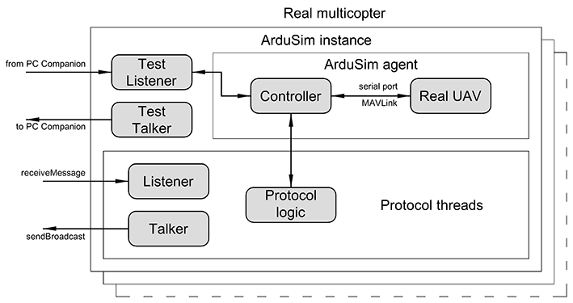

# Protocol development

## ArduSim architecture

roles

layers

## Packages structure

copter, simulator, pc companion and protocols

* main
* sim
* pccompaniom
* uavController
* api
* files
* ...

## main

## sim

## pccompanion

## uavController

## api

## files

## Application workflow

roles and diagram

## Protocol implementation

explain protocol integration functions

## Implementation details

### UAV-to-UAV Communications

functions

### UAV control

functions

### GUI integration

showing progress and drawing additional resources