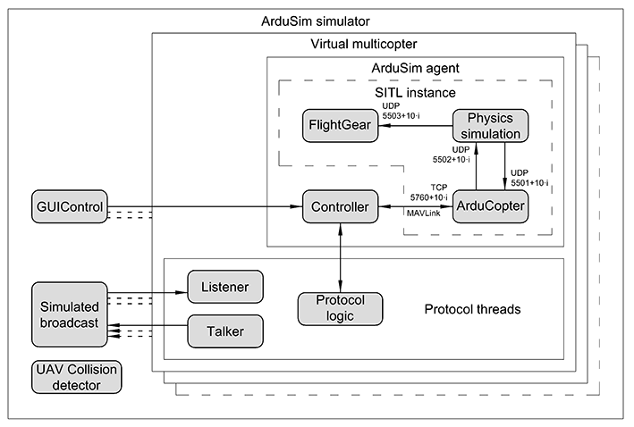

# Protocol development

This document explains in detail how to develop a new protocol in ArduSim.

## Table of contents

[1 ArduSim architecture](#markdown-header-1-ardusim-architecture)

[2 Packages structure](#markdown-header-2-packages-structure)

[3 Application workflow](#markdown-header-3-application-workflow)

[4 Protocol implementation](#markdown-header-4-protocol-implementation)

[5 Implementation details](#markdown-header-5-implementation-details)

## 1 ArduSim architecture

ArduSim is able to run performing three different roles:

* Simulator. The application runs on a PC and uses a SITL instance for each virtual multicopter that it simulates. A GUI is used to control the experiment.
* UAV agent (multicopter). The application runs on a Raspberry Pi 3 B+ attached to a multicopter. The experiment is controlled from a PC Companion.
* PC Companion. The application runs on a Laptop and allows to control an experiment followed by any number of real multicopters.

The code needed to run the PC Companion is completed and needs no further modification. When the protocol developer follows the included [recomendations](#markdown-header-55-implementation-recomendations), the same code used for simulation is also valid for a real multicopter, which makes the deployment on real devices somewhat trial. In order to make it possible, the multicopters are assigned a unique identifier (ID) based on their MAC address, or a number starting in zero if ArduSim behaves as a simulator.

### 1.1 Simulator

To simulate a great number of UAVs simultaneously, we have used the SITL application as a basic development module. SITL contains control code resembling a real UAV, simulating its physical and flying properties with great accuracy. A SITL instance is executed for each virtual UAV, and it runs together with its physical engine on a single process, as seen in the following image:



The proposed simulation platform relies on a multiagent simulation architecture that implements a high-level control logic above SITL itself.

ArduSim includes the simulation of packet broadcasting between UAVs (*Simulated broadcast*), and the detection of possible collisions (*UAV Collision detector*).

Each virtual multicopter is composed of an agent in charge of controlling the UAV behaviour, and the different threads required for the protocol being tested. The communication between UAVs requires a minimum of two threads, one for sending data packets (*Talker*), and another one for their reception (*Listener*). Both communication threads are automatically blocked when the experiment finishes, it is, when the multicopters land. In any case, we recommend to keep the thread *Listener* listening for data packets continuously, as up-to-date packets could discarded because the reception buffer fills up, and older packets are used.

An ArduSim agent includes a SITL instance, and a thread (*Controller*) in charge of sending commands to the multicopter, and of receiving the information that it generates.

The protocol under development can run more threads to control the behavior of the multicopter, like *Protocol logic*, but it is highly recommended to control the multicopter from the thread *Listener* if the multicopter behavior depends on the information received from other multicopters, to avoid any lag between the moment it receives information and the moment when the control action is applied.

### 1.2 UAV agent (multicopter)

The ArduSim simulator has been designed to facilitate the deployment of the implemented protocols in real UAVs.

When running ArduSim in a Raspberry Pi 3 B+, all the simulation-dependent software elements are disabled merely by changing an execution parameter, which makes the deployment of a newly developed protocol somewhat trivial.

The requirements to deploy on a real device are shown in the [Deployment on real devices - Raspberry Pi 3 B+](deployment.md) section.

The following image shows the architecture of the application when running on a real device.


If the threads of the protocol are programmed following the recomendations, the deployment is trivial, as the architecture remains the same.

Two new threads (*Test Listener* and *Test Talker*) communicate with the PC Companion. When commands to start the setup step or the experiment are received from the PC Companion, the thread *Test Listener* sends to the flight controller the appropriate commands the same way the thread *GUIControl* does when performing a simulation.

## 2 Packages structure

The Eclipse project in organized in packages. We suggest to enable the hierarchical presentation of packages in Eclipse to easily understand the project structure, which includes the following high level packages:

* **main**. This package includes the main method that runs the application (*Main.java*) as well as general parameters (*Param.java*) and text shown in GUI or messages (*Text.java*).
* **sim**. This package includes the parameters, logic and GUI related to simulation but not to the execution on a real multicopter.
* **pccompanion**. This package includes the parameters and GUI needed by the PC Companion, as well as the threads needed to communicate with the real multicopters.
* **uavController**. This package includes the parameters related to the real or virtual multicopter, the thread needed to control it, and the threads needed to communicate with the PC Companion.
* **api**. This is the most important package for the developer and it includes the following elements:
    * *pojo*. Collection of objects already used in ArduSim and that could be useful for any protocol; FlightMode of the multicopter, coordinates in UTM, geographic or screen frame...
    * *WaypointReachedListener.java* interface. Any protocol implementing this class can perform actions when the multicopter reaches a waypoint of the current mission (example available in MBCAP protocol, class BeaconingThread).
    * *Copter.java*. Includes methods to gather flight information from the multicopter or perform actions over it, like changing the flight mode, as explained in detail in "[5.2 UAV control](#markdown-header-52-uav-control)" section.
    * *GUI.java*. Includes methods to update the GUI and/or console during the protocol execution, as explained in detail in "[5.3 GUI integration](#markdown-header-53-gui-integration)" section.
    * *Tools.java*. Includes methods to coordinate the execution of the protocol with the simulator, transform coordinates between different frames, and load missions among other utilities, as explained in detail in "[5.4 Available utilities](#markdown-header-54-available-utilities)" section.
    * *files*. This package includes resources used when ArduSim is used as a Simulator.
* **... (protocols packages)**

Each new protocol must be selfcontained in an independent package. This way, the protocol code will be fully independent from ArduSim code, making it easy to update ArduSim to a new version, and easyly understandable for other programmers.

Several protocols have been already included in ArduSim:

* **None**. Completed. Mission based. This protocol simply makes the multicopters to follow a planned mission.
* **MBCAP**. Completed. Mission based. It avoids collisions among multicopters that are following a planned mission, as explained in the paper [MBCAP: Mission Based Collision Avoidance Protocol for UAVs](http://dx.doi.org/10.1109/AINA.2018.00090), presented in the "Advanced Information Networking and Applications (AINA 2018)" conference.
* **Swarm protocol**. Almost completed. Swarm based. It makes a swarm to follow a mission stored in one of them while keeping the formation stable. Furthermore, the takeoff of all the multicopters is safe until forming up in flight.
* **Chemotaxis**. Almost completed. Single multicopter. It enables a multicopter to dynamically move around an area looking for a hotspot using a sensor (e.g. heat on wildfires, pollution peaks,...).
* **Follow Me**. In progress. Swarm based. A swarm follows a multicopter that is manually controlled by a pilot.
* **Fishing**. In progress. Single multicopter. A multicopter follows a fishing boat drawing circles over it.

Please, feel free to reuse code from this protocols while developing a new one. "None" is the better starting point developing a protocol where all the multicopters must follow a planned mission, while "Swarm protocol" is more adecuate when developing a protocol for a swarm.

## 3 Application workflow

As explained in section "[1 ArduSim architecture](#markdown-header-1-ardusim-architecture)", ArduSim can be run performing three different roles. The next diagram shows the timeline of ArduSim execution since it is started until if finishes:


Rectangular boxes represent the functions included in section "[4 Protocol implementation](#markdown-header-4-protocol-implementation)" that must be implemented by the developer, while comments are automatic processes performed by ArduSim.

ArduSim starts loading the implemented protocols and parsing the command line to know which role will it run.

### 3.1 PC Companion

First of all, communications are set online. Then, when the user presses the "Setup" button the command is issued and the detected real multicopters execute the `setupActionPerformed()` method. Once the setup process is completed, the user can start the experiment with the corresponding button, and the multicopters execute the method `startExperimentActionPerformed()`. Immediately, if the developer needs it, a dialog can be opened with the function `openPCCompanionDialog()` where the user could analize the data packets sent among the multicopters.

At any moment, the user can start actions to take control over the multicopters if the protocol behavior is unexpected, like land or return to the launch location (RTL).

### 3.2 UAV agent (multicopter)

ArduSim assigns an unique ID to the multicopter and then loads the planned mission from a file (`loadMission()`), if the protocol needs it. Then, the method `initializeDataStructures()` is launched, where the developer can initialize the variables needed by the protocol taking into account the number of multicopters being run in the same ArduSim instance (one in this case, but many for simulations).

The logging of the path followed by the multicopter is started and the application sends some configuration to the flight controller and waits until the multicopter is located by the GPS system. Next, the planned mission (if any) is sent to it with the function `sendInitialConfiguration()`. I also can be used to retrieve more information or send commands to the multicopter needed before starting the threads of the protocol with the function `startThreads()`. We recommend to retrieve any needed UAV configuration before starting the threads in the previous function. Please remember that the threads are started here, but they execution probably must wait until the user presses the "Setup" and/or "Start" buttons, when the functions `setupActionPerformed()` and `startExperimentActionPerformed()` are run. This can be achieved with the functions explained at the beginning of section "[5.4 Available utilities](#markdown-header-54-available-utilities)". They are solely enough to coordinate the threads with ArduSim.

The experiment is finished when the multicopter lands and the engines stop. Some protocols will land the UAV automatically, but others could finish while the UAV is flying, like *MBCAP*. In the second case, the function `forceExperimentEnd()` must be implemented to detect the end of the experiment and land the multicopter.

Once the experiment is finished, the methods `getExperimentResults()` and `getExperimentConfiguration()` allow the developer to generate Strings with general information and configuration of the protocol that will be included in the default log files. Additionally, the method `logData()` can be used to store files with more information.

### 3.3 Simulator

The most important difference between "*UAV agent*" and "*Simulator*" roles implementations is the number of multicopters that run in the same machine, one in the former and many in the later. It is highly suggested to store data in array variables with the length of the number of UAVs that run in the machine, so in the real UAV the array length will be 1, and the code will be valid for both roles (see section "[5.5 Implementation recomendations](#markdown-header-55-implementation-recomendations)"). Good implementation examples can be found in "MBCAP" and "Swarm protocol" protocols. A function is provided to know which ID (multicopter) corresponds to a specific position in the array, as detailed in section "[5.4 Available utilities](#markdown-header-54-available-utilities)". This function will provide the ID of the multicopter when running on a real UAV, as the array has a length of 1. On the other hand, no function is provided to get a UAV location in the array given the ID, as it will always be 0 in the real UAV, and in simulation the ID is equivalent to the position in the array.

When ArduSim is run, it also checks if the computer meets some requirements and opens a general configuration dialog. There, the user can set many simulation parameters, as well as the maximum flight speed for each virtual multicopter. Then, when the configuration is set, the function "*openConfigurationDialog()*" may launch a dialog to introduce values for parameters of the protocol under development. Next, planned missions are loaded for the multicopters specified by the protocol.

In the next step, the main window of the simulator is opened an IDs are assigned to the virtual UAVs. The function "*initializeDataStructures()*" allows the programmer to initialize the variables needed by the protocol. As stated before, it is highly recommended to use arrays with the length of the number of UAVs that are being run on the same machine at the same time. This way the code will be valid in simulation an running in a real multicopter.

In simulation, another difference compared to a "*UAV agent*" is the presence of a GUI. By default, the UAVs, their planned mission if any, and the path they are following are being draw automatically. Nevertheless, the developer may want to draw additional elements, like other objects to define a safety fence around the UAVs, or to show information related to the protocol. In that case, the function `loadResources()` allow the programmer to dynamically load images to be drawn. The function `drawResources()` can be used to draw this elements each time the screen is updated. The methods `rescaleDataStructures()` and `rescaleShownResources()` allow to re-scale the drawn elements each time the drawing scale changes. Additionally, the method `setInitialState()` can be implemented to show a text for each UAV with its initial state in the protocol, that is shown when the "*Progress dialog*" is opened.

The function `setStartingLocation()` provides the starting location of the virtual multicopters and then the simulation can start. If the multicopter has to follow a mission, we suggest to set the first point of the mission as the starting location. Once the current location is acquired, the virtual UAV-to-UAV communication link is stablished and the collision detection is enabled. The functions `sendInitialConfiguration()`, `startThreads()`, `setupActionPerformed()`, `startExperimentActionPerformed()`, `forceExperimentEnd()`, `getExperimentResults()`, `getExperimentConfiguration()`, and `logData()` are the same explained for the "*UAV agent*" role.

There are another two differences compared to a "*UAV agent*". First, a set of pictures are downloaded from Google Static Maps to integrate the background image, which is geopositioned on the theoretical location of the virtual UAVs. Second, storing the experiment results is optional, while in a real UAV is always accomplished. Sadly, Google has stopped serving the background images for free, so the background map will not be available until a new version of ArduSim is released. We are planning to give support to Bing images, and also give the user the chance to use a paid key to utilize the current implementation for Google Static Maps.

## 4 Protocol implementation

To start a new protocol, the developer creates a new package (*ProtocolName*) to contain the corresponding Java classes. Then, the first step consists in create a new Class that "extends" "*api.ProtocolHelper.java*" Class. It forces the developer to implement the functions already mentioned, to integrate the protocol in ArduSim. An extended explanation of these functions follows. All functions must be implemented if not indicated otherwise.

* `void setProtocol()`. It assigns a String name to the protocol to enable the implementation, using the variable `this.protocol`. This way, the protocol is enabled and can be used in ArduSim.
* `void openConfigurationDialog()`. It opens a dialog implemented by the protocol developer, and that allows the user to input parameters related to the protocol. When the dialog is accepted, please remember to issue the command `api.Tools.setProtocolConfigured(true)` to force the simulator to open the main window. It the developer want to skip a dialog, then it is enough to call the forementioned function.
* `void openPCCompanionDialog(JFrame)`. Optional. This method enables the developer to implement a dialog to analyze the behavior of the protocol on the PC Companion, when the protocol is deployed in real multicopters. If you decide to use this method, an additional thread must be implemented to update the information shown in the dialog, based on the data packets that are being broadcasted from the real UAVs. The thread must be started once the dialog is completely built.
* `boolean loadMission()`. On a real multicopter it must return true if and only if a planned mission must be followed by the UAV. The mission file must be stored beside the ArduSim *.jar* file.
* `void initializeDataStructures()`. The protocol being developed will need several variables shared among threads, that should be declared following the package structure, as shown below. This method allows to initialize the variables once the number of UAVs running in the same machine is known (more than one if a simulation is performed).
* `void loadResources()`. Optional. Used to load from file elements that the protocol will draw in screen.
* `Pair<GeoCoordinates, Double>[] setStartingLocation()`. Used to set the location where the multicopters appear in simulation, including latitude, longitude and heading. By default, they appear at 0 absolute altitude.
* `boolean sendInitialConfiguration(int)`. It reads from the multicopter any additional configuration values needed by the protocol, and sends to it any command needed to configure it.
* `void startThreads()`. This method is used to start the threads used by the protocol. Then, ArduSim waits the user to press the setup button. In general, the threads must use methods included in *api.Tools.java* Class to wait until the setup or start button is pressed before performing any action (see the beginning of section "[5.4 Available utilities](#markdown-header-54-available-utilities)").
* `void setupActionPerformed()`. This method must wait until any action required for the setup step is finished (blocking method). It is more addecuate to simply wait until the protocol threads finish the action using a shared concurrent variable than implementing here the actions, as the may require the use of more than one thread.
* `void startExperimentActionPeformed()`. It is useful to perform the takeoff, or to start a mission from the ground. If the protocol needs to perform additional actions over the UAV, it is recommended to do it in the protocol threads to free the thread and allow it to check periodically if the experiment finishes. In any case, you can always perform the actions directly in the protocol threads. If you use this method to perform the take off, the protocol threads should wait until a shared variable is changed when the takeoff process finishes. Nevertheless, while following a mission the control over the multicopter is released immediately after the mission start, so the protocol must have its own logic to decide when to take control over the multicopter.
* `void forceExperimentEnd()`. Optional. An experiment is considered to be finished when all UAVs land and stop engines. Once the previous method finishes, this one is issued periodically and allows to land the UAVs to finish the experiment if a condition is met. For example, when the UAV is following a planned mission and it is close enough to the last waypoint (`api.Copter.landIfMissionEnded(int)`). The protocol may issue other actions to land the UAV from other threads. In that case, this method could be left unimplemented.
* `String getExperimentResults()`. Optional. Allows to add data related to the protocol to the information shown in the results dialog.
* `String getExperimentConfiguration()`.Optional. The developer has the option to show the value of the parameters used in the protocol in the results dialog, so they could be stored to be able to reproduce the same experiment again.
* `void logData(String, String)`. Optional. Stores information gathered by the protocol during the experiment.
* `String setInitialState()`. Optional. ArduSim can show a String representing the state of the protocol for each UAV in the "*progress dialog*". This method sets the initial value or initial state of the protocol, when the multicopter is ready to fly.
* `void rescaleDataStructures()`. Optional. Used when additional elements are drawn in screen by the protocol. It rescales data structures used for drawing when the drawing scale changes.
* `void rescaleShownResources()`.Optional. Used when additional elements are drawn in screen by the protocol. It rescales the resources (images) used for drawing when the drawing scale changes.
* `void drawResources(Graphics2D, BoardPanel)`. Optional. Periodically draws the resources used in the protocol in the Graphics2D element of the specified BoardPanel.

The recommended package structure for the protocol follows:

* **protocolName.gui**. This package should contain graphical elements, such as the dialog used to input values for the protocol parameters, or the dialog used in the PC Companion when deploying the protocol in real multicopters. The later is optional.
* **protocolName.logic**. It should contain classes related to the protocolo logic, for example:
    * *ProtocolNameHelper.java*. The protocol implementation already detailed.
    * *ProtocolNameParam.java*. Declaration of variables needed by the protocol. Please, see other protocols as example.
    * *ProtocolNameText.java*. Texts used in GUI or messages for the protocol.
    * *ProtocolNamePCCompanionThread.java*. Thread that can be implemented to update data in the dialog used by the PC Companion, if implemented.
    * *ProtocolNameOtherThreads.java*. Threads needed by the protocol. If more than one multicopter is needed and they have to communicate among them, then at least one thread to talk and another to listen to other UAVs must be implemented. Remember that these threads are automatically blocked once the experiment finishes.
* **protocolName.pojo**. Should contain classes to define objects useful for classes implemented in the previous packages.

## 5 Implementation details

This sections includes several details about the way ArduSim implements relevant elements needed by the developer, and some implementation recommendations to make the same code work in virtual and real multicopters, which would make the code more clear and easy to re-use. 

### 5.1 UAV-to-UAV Communications

Real multicopters use WiFi to broadcast UDP messages among them. On the other hand, broadcast is simulated among virtual UAVs when ArduSim is run as a simulator. In order to make the same code valid for both roles, an abstraction layer has been implemented over communications. Three functions have been implemented that help the developer to ignore communication details:

* `void api.Copter.sendBroadcastMessage(int, byte[])`. A multicopter sends a broadcast message to other UAVs encoded in a byte array. Please, remember that broadcast messages may also be received by the sender, so they must be explicitly ignored in the sender *Listener* thread. Moreover, avoid sending messages continuously. First, it would saturate the media in real multicopters, and second, in simulation it would require a core per thread sending messages, as communications are simulated by active code, without passive waiting.
* `byte[] api.Copter.receiveMessage(int)`. A multicopter receives a message sent from another UAV. The method blocks until a message is received, as in a real socket. We recommend to listen for packets continuously. Otherwise, you would loose data updates, keeping in buffer old messages. Please, use only one thread by multicopter for listening for data packets with this or the later functions. In a real multicopter, it is possible to listen to a port from two sockets, but then you would be unable to control which thread receives each message.
* `byte[] api.Copter.receiveMessage(int,int)`. In this case, the method blocks until a message is received, or the specified timeout completes. This function is equivalent to issue the `setSoTimeout(int)` method before the `receive()` method over a normal Socket.

The last two functions can be used only by one thread on each multicopter, as in real sockets, if more than one thread listen on the same port, you could not control wich thread receives each packet, falling on an unpredictable behavior.

### 5.2 UAV control

The Class *api.Copter.java* includes several functions to send commands to the multicopter and to retrieve information from it. Most commands return a boolean meaning whether the command was successfully completed or not, which allows the developer to process errors at a higher level. An integer value represents the position of the multicopter the command is applied to in the array of UAVs running in the same machine (one in a real UAV, and many in simulation).

Simple command functions:

* `boolean setParameter(int, ControllerParam, double)`. The developer can modify one of the parameters of the flight controller as included in *uavController.UAVParam.ControllerParam* enumeration. The most appropriate place would be the function `sendInitialConfiguration(int)` of the protocol implementation, before starting the protocol threads (see section "[3 Application workflow](#markdown-header-3-application-workflow)").
* `Double getParameter(int, ControllerParam)`. Parameter values can be retrieved from the flight controller at any time, but again, the most appropriate place is the method `sendInitialConfiguration(int)`.
* `boolean setFlightMode(int, FlightMode)`. It changes the flight mode as defined in *api.pojo.FlightMode* enumeration.
* `boolean armEngines(int)`. It arms the engines so the flight could be started. The multicopter must be on the ground and in an armable flight mode. On a real UAV, the hardware switch for safety arm must be pressed before, if available.
* `boolean guidedTakeOff(int, double)`. It takes off to the target relative altitude. The multicopter must be in GUIDED flight mode and armed.
* `boolean setHalfThrottle(int)`. To start a mission, the throttle value must be moved from the minimum value (default value when no remote control is present) to a higher value, once the engines are armed and the flight mode is set to AUTO. This method rises the throttle value overriding the corresponding channel of the remote control. Moreover, it sets yaw, pitch and roll to their trim (middle) value to keep the UAV static in the horizontal plane. Channel override is enabled by default and cannot be enabled again once used the function `returnRCControl(int)`.
* `void channelsOverride(int, int, int, int, int)`. It allows to simulate the joysticks of the remote control, providing values for yaw, pitch, roll and throttle. Commands must be issued at least once a second in a loop or the control could be returned to the real remote (guaranteed crash if no remote control is present). It is also recommended to avoid sending this message with a period lower than 0.4 seconds or some commands could be ignored by the flight controller. Channel override is enabled by default and cannot be enabled again once used the function `returnRCControl(int)`.
* `boolean returnRCControl(int)`. It allows to release the control of the flight to the remote control, canceling the channels overriding. It is used by the PC Companion and may be used by any protocol, but be aware, it can only be used once and a pilot must be ready and with the remote control turned on or the multicopter would crash!
* `boolean setSpeed(int, double)`. It modifies the planned flight speed, it is, the maximum flight speed for the multicopter. In a mission, it is the constant speed it will follow through a straight line, and in GUIDED flight mode it is the maximum speed adopted by the flight controller while executing commands.
* `boolean moveUAVNonBlocking(int, GeoCoordinates, float)`. It send a command to go to a specific location in GUIDED flight mode.
* `boolean moveUAV(int, GeoCoordinates, float, double, double)`. It performs the same action as the previous method but additionaly it blocks until the multicopter approaches enough to destination.
* `void moveUAV(int, GeoCoordinates, float)`. As the function `moveUAVNonBlocking`, it sends a command to move to a specific location without blocking, and additionally it uses a different approach, without waiting response from the flight controller (command *SET_POSITION_TARGET_GLOBAL_INT*). This function is useful when a continuous control of the multicopter is desired (frequent changes in the target location).
* `boolean clearMission(int)`. It removes the mission stored in the flight controller, if any.
* `boolean sendMission(int, List<Waypoint>)`. It sends a new mission to the flight controller. We recommend to remove the current mission before sending a new one.
* `boolean retrieveMission(int)`. Recovers the mission stored in the flight controller and makes it available with the function `api.Tools.getUAVMission(int)`. It also updates the simplified mission shown on screen, also available with the function `api.Tools.getUAVMissionSimplified(int)`.
* `boolean setCurrentWaypoint(int, int)`. It changes the current waypoint in the mission the UAV has to follow.

Complex command functions. These functions have been built combining functions from the previous list to perform more complex tasks. To use this functions is preferable than using simple command functions when they are addequate to the programmer purpose.

* `boolean startMissionFromGround(int)`. It takes off and starts the planned mission stored in the flight controller. The multicopter must be on the ground and in an armable flight mode. On a real UAV, the hardware switch for safety arm must be pressed before, if available.
* `boolean startMissionsFromGround()`. It takes off at the same time all the UAVs running in the same machine and starts the planned missions stored in the flight controllers. The multicopters must be on the ground and in an armable flight mode. On real UAVs, the hardware switch for safety arm must be pressed before, if available.
* `boolean takeOffNonBlocking(int, double)`. It performs all the needed actions to take off without waiting to reach the target altitude. The multicopter must be on the ground and not armed.
* `boolean takeOff(int, double)`. It also performs the take off but waits until the multicopter reaches the target altitude. The multicopter must be on the ground and not armed.
* `boolean takeOffAllUAVsNonBlocking(double[])`. It takes off at the same time all the UAVs running in the same machine, as in function `takeOffNonBlocking(int, double)`.
* `boolean takeOffAllUAVs(double[])`. It takes off at the same time all the UAVs running in the same machine, as in function `takeOff(int, double)`.
* `boolean stopUAV(int)`. It sharply stops the multicopter in flight while performing a planned mission. The mission can be resumed later changing to AUTO flight mode.
* `void landIfMissionEnded(int, double)`. This method lands the multicopter if it is close enough to the last waypoint, and can be launched periodically in the method `forceExperimentEnd()` of the protocol implementation. Useful for UAVs that follow a planned mission.
* `boolean landUAV(int)`. This method is used to land a UAV.
* `boolean landAllUAVs()`. In this case, all the UAVs receive the land command.
* `boolean cleanAndSendMissionToUAV(int, List<Waypoint>)`. It deletes the current mission of the UAV, sends a new one, and retrieves it from the flight controller to show it on the GUI, using the corresponding simple command functions. This function is automatically used by ArduSim before the `sendInitialConfiguration(int)` method of the protocol implementation.

Now follows a list of information retrieval functions that don't need to communicate with the flight controller. The data could be slightly outdated, on the order of milliseconds, as this information is retrieved periodically.

* `FlightMode getFlightMode(int)`. This method provides the current flight mode of the multicopter.
* `boolean isFlying(int)`. It reports whether the multicopter is flying or not (on the ground and engines off).
* `Quintet<Long, UTMCoordinates, Double, Double, Double> getData(int)`. This method gives the most up-to-date data received from the flight controller, including coordinates, speed, acceleration and the moment when they were received from the flight controller.
* `UTMCoordinates getUTMLocation(int)`. It provides only the current UTM coordinates.
* `GeoCoordinates getGeoLocation(int)`. In this case, it provides the current geographic coordinates (latitude and longitude).
* `Location2D getLocation(int)`. It provides both the UTM, and the geographic coordinates.
* `UTMCoordinates[] getLastKnownUTMLocations(int)`. This function gives the last known locations of the UAV, starting with the older.
* `double getZRelative(int)`. It provides the current relative altitude over the home location.
* `double getZ(int)`. It provides the current absolute altitude over the sea level.
* `double getSpeed(int)`. This method gives the current flight speed.
* `double[] getSpeeds(int)`. In this case, the current flight speed for the three cartesian axes is provided.
* `double getPlannedSpeed(int)`. This method provides the maximum flying speed used by the flight controller. In a mission, it is the constant speed it will follow through a straight line, and in GUIDED flight mode it is the maximum speed adopted by the flight controller while executing commands.
* `double getHeading(int)`. This method gives the current yaw or heading of the multicopter.
* `void setWaypointReachedListener(WaypointReachedListener)`. Any Class can implement *WaypointReachedListener.java*, as *mbcap.logic.BeaconingThread* does. Then, using this method, that Class would be able to apply some logic each time the flight controller detects that a waypoint has been reached. It is useful for UAVs that follow a planned mission.
* `int getCurrentWaypoint(int)`. It provides the identifier of the current waypoint of the mission. Useful for UAVs that follow a planned mission.
* `boolean isLastWaypointReached(int)`. It asserts if the last waypoint of the mission has been reached. Useful for UAVs that follow a planned mission.

### 5.3 GUI integration

A few functions have been implemented in Class *api.GUI.java* to update data already shown in the GUI, and to allow the developer to introduce new elements in the drawing panel.

The next list of functions allow the developer to update the GUI, and even close ArduSim when an unexpected behavior is detected, showing a message before closing the application.

* `void log(String)`. This method shows a message in console. Furthermore, if ArduSim runs as a simulator, the same message is shown in the log in the upper left corner of the main window.
* `void log(int, String)`. In this case, the shown text is prepended with the identifier of the multicopter the message is related to.
* `void logVerbose(String)`. In this case, the message is only shown if verbose logging mode is enabled.
* `void logVerbose(int, String)`. Like in a previous case, the shown text is prepended with the identifier of a multicopter.
* `void updateProtocolState(int, String)`. The *progress dialog* shows general information for each running virtual UAV. This function is used to show there the current state of the protocol to compare the behavior when different UAVs are in a different state.
* `void updateGlobalInformation(String)`. On the upper right corner of the main window, below the interaction buttons, there is a *String* where you can show any information with this function.
* `void warn(String, String)`. On a real UAV, it writes a message to console, while in simulation it opens a dialog to warn the user.
* `void warn(int, String, String)`. Like the previous function, it warns the user, but prepending the ID of the multicopter the information is related to.
* `void addEscapeListener(JDialog)`. This method allows to close the configuration dialog used for any protocol (see function `openConfigurationDialog()` of the protocol implementation), and ArduSim whenever the escape key is pressed. It can be thrown once the dialog is builded, and it must not be used in any custom dialog used after the main window is built.
* `void exit(String)`. The behavior is the same as the previous method, but additionally it closes ArduSim with a error code. If ArduSim runs as a simulator and before exiting, all SITL instances are closed and temporary files are removed.

Mission loading. The user can load missions from several QGroundControl files or from a single Google Earth *.kml* file. In the second case, it ends when the multicopter reaches the last waypoint, and it remains flying over it. In this case, the user can add an extra waypoint to the end of the mission to make the UAV land or return to the launch location (RTL). In a real UAV, this can be achieved by means of a parameter in the *arducopter.ini* file, and in simulation the user is prompted to select the option.

In a real multicopter, the mission is automatically loaded if the function `loadMission` of the protocol implementation returns true, and in simulation the developer can use the following functions to force the user to load missions (see MBCAP, None or Scan protocols as utilization reference):

* `Pair<String, List<Waypoint>[]> loadMissions()`. This method opens a dialog to select a *.kml* file or several *.waypoints* files, and returns the missions loaded, and the path of the *.kml* file or the folder where the *.waypoints* files were located. After this function, the method `Tools.setLoadedMissionsFromFile(List<Waypoint>[])` must be called to provide to ArduSim the missions loaded. The array provided must have at least the same length as the number of UAVs running in the current machine (check `Tools.getNumUAVs()`).
* `Pair<String, List<Waypoint>[]> loadKMLMissions()`. In this case, the behavior is the same as the previous version, but only a single *.kml* file can be selected.
* `Pair<String, List<Waypoint>[]> loadWaypointMissions()`. Similar to the previous case, only one or more *.waypoints* file can be selected.

The following functions are useful to draw new elements in the main panel using the methods `loadResources()`,  `drawResources(Graphics2D, BoardPanel)`, `rescaleDataStructures()`, and `rescaleShownResources()` in the protocol implementation, as explained in section "[4 Protocol implementation](#markdown-header-4-protocol-implementation)".

* `Point2D.Double locatePoint(double, double)`. It provides the screen coordinates of a point given its UTM coordinates.
* `Point2D.Double locatePoint(UTMCoordinates)`. This method is equivalent to the former.
* `Color getUAVColor(int)`. It provides the Color assigned to a UAV to be used to draw linear elements on the screen, like the path followed by the UAV, which is  automatically drawn. Please, notice that each multicopter has a different color asigned.

Two methods can be used in the PC Companion instance:

* `StatusPacket[] getDetectedUAVs()`. It returns an array of objects with the ID of the detected UAVs, and with their number as size. This can be used in the protocol dialog. It is useful to build the GUI before launching a thread to update it depending on the present UAVs. A usage example can be found in the protocol *MBCAP*.
* `int api.pojo.Tools.getUDPBroadcastPort()`. With this function you can get the port number where the UAVs are listening for data packets. It is useful to listen to the transmissions in the swarm.

### 5.4 Available utilities

Many functions have been implemented in Class *api.Tools.java* to help the developer to interact with ArduSim and the multicopters.

The first list includes helper functions to know which is the current state of the execution of ArduSim. This methods should be used in the protocol threads to wait for the adequate moment to perform any action.

* `boolean areUAVsAvailable()`. This function returns *true* when the multicopter/multicopters are ready to fly or even flying.
* `boolean areUAVsReadyForSetup()`. In this case, the UAVs are ready, but the setup step has not been started.
* `boolean isSetupInProgress()`. The setup step is in progress.
* `boolean isSetupFinished()`. The setup step is finished and the UAVs are ready to start the experiment.
* `boolean isExperimentInProgress()`. This method returns *true* if the experiment is in progress.
* `boolean isExperimentFinished()`. Finally, this method returns *true* if the experiment has ended, it is, if all the UAVs running in this machine have landed.

    Two code examples follow. The first and second examples wait until the setup step starts, but the second option could cause a race condition if the programmer decides to skip the setup step. The third case waits from the beginning until the experiment starts, and until the multicopter starts the flight.
    
    ```java
    while(!api.Tools.areUAVsAvailable() || api.Tools.areUAVsReadyForSetup()) {
        api.Tools.waiting(time);
    }
    ```

    ```java
    while(!api.Tools.isSetupInProgress()) {
        api.Tools.waiting(time);
    }
    ```

    ```java
        while (!Tools.isExperimentInProgress() || !Copter.isFlying(numUAV)) {
            Tools.waiting(time);
        }
    ```

Now follow commands needed to coordinate each protocol with ArduSim:

* `void setNumUAVs(int)`. A protocol may need to change the number of running UAVs on the same machine when performing a simulation. This method may be used in the configuration dialog of the protocol for that purpose. For example, if the protocol needs to load missions for the multicopters, it can reduce the number of simulated UAVs if the number of missions loaded is lower than expected (i.e. protocol *MBCAP*).
* `int getNumUAVs()`. This method returns the number of UAVs that are running on the same machine, 1 when running on a real UAV or many when performing a simulation.
* `void getArduSimRole()`. It returns an integer that represents the role of the current ArduSim instance, it is, if it runs in a real multicopter, a simulation, or as a PC Companion. You can compare this value with Tools.MULTICOPTER, Tools.SIMULATOR, and Tools.PCCOMPANION to decide what to do depending on the role of ArduSim.
* `long getIdFromPos(int)`. All the internal variables of ArduSim are stored as arrays of length the number of multicopters running on the same machine (1 in a real UAV). This function provides the identifier used for the UAV given the position in the array (always 0 in a real UAV). When performing a simulation, the ID is always the position in the array, but in a real multicopter it returns a unique ID based on the MAC address. The inverse function is not available as it is useless (on a real UAV the position in array is always 0, and in simulation the position and the ID are equal).
* `void setProtocolConfigured()`. This function must be used when the protocol configuration dialog is closed to inform ArduSim that it can continue, opening the main window.
* `void waiting(int)`. Wrapper method to make the current Thread wait for a period of time.

In the configuration dialog, the developer can load missions from files to be followed by the multicopters (on a real UAV the mission is loaded automatically). Moreover, they can be accessed later on:

* `void setLoadedMissionsFromFile(List<Waypoint>[])`. If missions are loaded with the functions provided in section [5.3 GUI integration](#markdown-header-53-gui-integration), this method must follows to make the missions available for ArduSim. Remember that the provided array must have the same length as the number of multicopters running on the same machine (see function `Tools.getNumUAVs()`), leaving the appropriate holes (null) in the array if not all the UAVs need a mission.
* `List<Waypoint>[] getLoadedMissions()`. This function provides the missions already loaded from file. This function must not be used before the previous function.
* `List<Waypoint> getUAVMission(int)`.This method provides the mission currently stored in the UAV. It must be previously sent to the flight controller with the function `api.Copter.cleanAndSendMissionToUAV(int, List<Waypoint>)`.
* `List<WaypointSimplified> getUAVMissionSimplified(int)`. As in the previous case, this method must be invoked once the mission is sent to the drone. It provides the mission that is show on screen when performing a simulation. This mission is simplified, as it lacks of waypoints that don't add new line segments to the shown path. As example, it is used in *Swarm Protocol* to build the path the UAVs have to follow.

ArduSim can detect possible collisions among UAVs when performing a simulation. Never use this methods when running in a real multicopter.

* `boolean isCollisionCheckEnabled()`. This function returns true if the collision check feature is enabled.
* `double getCollisionHorizontalDistance()`. It provides the maximum distance to assert that a collision has happened.
* `double getCollisionVerticalDistance()`. Similar to the previous method, this one gives the maximum vertical distance to assert that a collision has happened.
* `boolean isCollisionDetected()`. It returns *true* if a collision has happened between two multicopters.

The flight controller uses geographic coordinates, but they are not useful to calculate distances. These functions are provided to transform between geographic and UTM coordinates:

* `GeoCoordinates UTMToGeo(double, double)`. It translates Universal Transverse Mercator (UTM) coordinates to Geographic coordinates (latitude and longitude).
* `GeoCoordinates UTMToGeo(UTMCoordinates)`. Equivalent to the previous function.
* `UTMCoordinates geoToUTM(double, double)`. It translates Geograhic coordinates to UTM coordinates.
* `UTMCoordinates geoToUTM(GeoCoordinates)`. Equivalent to the previous function.

The following functions help to validate values introduced by the user in a dialog:

* `boolean isValidPort(String)`. It checks if a String represents a TCP port in the range [1024, 65535].
* `boolean isValidBoolean(String)`. It checks if a String represents a valid boolean value.
* `boolean isValidPositiveInteger(String)`. It checks if a String represents a positive integer.
* `boolean isValidDouble(String)`. It checks if a String represents a double.
* `boolean isValidPositiveDouble(String)`. It checks if a String represents a positive double.

Now, we include several functions to retrieve information, and to store specific protocol data when the experiment finishes:

* `long getExperimentStartTime()`. It returns the Java VM time value when the experiment started.
* `long getExperimentEndTime(int)`. It returns the Java VM time value when a UAV finished the experiment, it is, when it landed.
* `String timeToString(long, long)`. Given an initial and final time provided by the function `System.currentTimeMilis()`, it transforms the elapsed time in human readable text.
* `double round(double, int)`. It rounds a double to a specific number of decimal digits, useful to show on screen or store in a file.
* `List<LogPoint> getUTMPath(int)`. It provides the path followed by a UAV for logging purposes.
* `File getCurrentFolder()`. It provides the folder ArduSim is running in, and is useful to write output files related to the protocol.
* `String getFileExtension(File)`. It returns the file extension of a given *File*.
* `void storeFile( File, String)`. It stores a *String* in a *File*.
* `boolean isVerboseStorageEnabled()`. This function may be used to decide if some information must be stored in a *File*.

Finally, ArduSim provides tools to form the swarm formation. The layout can be built from scratch, but several flying formations have been included to make easier to develop a new protol. The package *api.pojo.formations* includes a general class *FlightFormation*, and several formation implementations that can be used in any protocol, like shown in *Scan Protocol*. Follows a list of implemented formations:

* *Linear*. The UAVs are ordered in a straight line perpendicular to a specific heading, and numbered from left to right.
* *Regular matrix*. The UAVs are ordered in a square matrix, and numbered from left to right, and from bottom to up.
* *Compact matrix*. The center UAV is surrounded by the remaining at the closest location to the center of the formation.
* *Circle*. A center UAV is surrounded by the remaining forming a circle, and the are numbered; first the center UAV, and then the remaining counterclockwise starting on the right.
* *Compact mesh*. The center UAV is surrounded by the remaining at the closest location to the center of the formation. Always, the distance from a UAV to the surrounding UAVs is the same.

In all cases, the center multicopter is the UAV closest to the rest of UAVs (center of line, matrix or circle). The following general functions of the class *api.pojo.formations.FlightFormation* allow the developer to use this feature. You can set values in the `void openConfigurationDialog()` function of the protocol implementation, or retrieve then wherever you want.

* `Formation getGroundFormation()`. This method provides the formation of UAVs used for the ground layout in simulations.
* `void setGroundFormation(Formation)`. It sets the flight formation of UAVs used for the ground layout in simulations (after user input).
* `double getGroundFormationDistance()`. In this case, it provides the minimum distance between contiguous UAVs in the formation used for the ground layout in simulations.
* `void setGroundFormationDistance(double)`. It sets the minimum distance between contiguous UAVs in the formation used for the ground layout in simulations (after user input).
* `Formation getFlyingFormation()`. This function provides the formation of UAVs used for the flying layout.
* `void setFlyingFormation(Formation)`. It sets the flight formation of UAVs used for the flying layout (after user input).
* `double getFlyingFormationDistance()`. In this case, it provides the minimum distance between contiguous UAVs in the formation used for the flying layout.
* `void setFlyingFormationDistance(double)`. It sets the minimum distance between contiguous UAVs in the formation used for the flying layout (after user input).
* `double getLandingFormationDistance()`. This function provides the minimum distance between cotiguous UAVs while landing.
* `void setLandingFormationDistance(double)`. It sets the minimum distance between contiguous UAVs while landing.

You can use a swarm formation for the ground UAVs layout or not (it's not mandatory, you can set their starting location manually). As examples, the protocol MBCAP sets the initial location of the UAVs in the first point of the loaded mission, while the Scan Protocol uses the previous flight formations.

The class *api.pojo.formations.FlightFormation* also provides the following methods to define the layout of the swarm:

* `static FlightFormation getFormation(Formation, int, double)`. Once you know which formation type to use (Formation), you can instantiate the formation with this method, providing the number of UAVs in the formation, and the minimum distance between contiguous UAVs. It returns an object with the rest of functions.
* `int getCenterUAVPosition()`. It provides the position of the UAV in the center of the formation. 
* `UTMCoordinates getOffset(int, double)`. With this method you can get the offset of the UAV from the center UAV in UTM coordinates, given its position in the formation, and the center UAV heading.
* `UTMCoordinates getLocation(int, UTMCoordinates, double)`. It provides the location of a UAV in UTM coordinates, given its position in the formation, and the center UAV location (UTM) and heading (rad).
* `Triplet<Integer, Long, UTMCoordinates>[] matchIDs(UAV2DLocation[], double, boolean, Long, FlightFormation)`. This function matches the best formation in flight for the given ground location for the UAVs, and heading towards the formation must be built. The best formation is the one where the UAVs have to move less distance to the flying formation during the takeoff phase.
* `Pair<Integer, Long>[] getTakeoffSequence(Map< Long, UTMCoordinates>, Triplet<Integer, Long, UTMCoordinates>[])`. This function provides a sorted array beginning with the UAVs that have to move further (takeoff order), with their position in the formation, and their ID, allowing to define a takeoff sequence optimal to avoid possible collisions.

Finally, you can build a new type of formation. You have to create a Class that extends *FlightFormation.java* Class, and then implement the `void initializeFormation()` method to generate the layout (center UAV position, and an array with the points of the formation with their corresponding offset from the center UAV). The constructor only has to call the *super* equivalent. Finally, you need to add the new implemented formation to the `static FlightFormation getFormation(Formation, int, double)` method, and to the *FlightFormation.Formation* enumerator.

### 5.5 Implementation recomendations

At this moment, the developer has enough information to implement a new protocol, using the already included protocols as reference. Nevertheless, the code could be fully functional on simulation, but not in a real multicopter. The developer must understand the way ArduSim implements the communications with UAVs to make the protocol work also in a real multicopter without modifying the code.

Any internal variable of ArduSim is stored as an array. The function `api.Tools.getNumUAVs()` gives the number of UAVs that are running on the current machine, with the current instance of ArduSim, and represents the length of the arrays. On simulation, it is any number between 1 and 256, and in a real multicopter it is always 1, the real flight controller ArduSim is connected to.

Any function used to get information from a real or virtual multicopter must be called with the parameter "numUAV", which is the position of the UAV in the arrays, a number in the range `[0, api.Tools.getNumUAVs() - 1]`. In a real UAV, the length of the arrays is 1, the position of the real UAV is 0, and the ID is based on the MAC address of the network adapter. On the other hand, in simulation, the UAVs ID starts in 0, and their position in the arrays also has the same value.

It is highly recommended to initialize the variables used by the protocol in the method `initializeDataStructures()` of the implementation with the same approach, with arrays of length `api.Tools.getNumUAVs()` and starting threads in function `startThreads()` of the implementation for all UAVs from 0 to `api.Tools.getNumUAVs() - 1`. This way the protocol code will be correct for real or virtual multicopters regardless the number of UAVs running on the same machine, as it is a dynamic value defined when ArduSim is run.

"MBCAP" and "Swarn protocol" are good examples on how to make the code work for real and virtual UAVs. The ID of each UAV is used inside messages transmitted among UAVs, and the location of the UAV in the arrays is used in functions and variables.