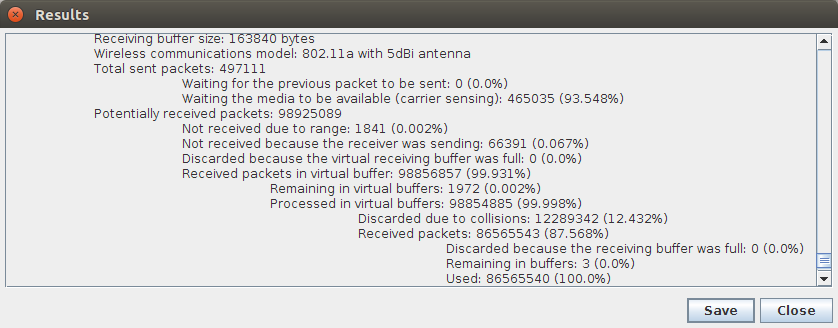

# ArduSim usage

We already explained that ArduSim can be used in two ways. First, it can be used to develop a new protocol, simulating the UAVs behavior for debugging until the protocol is ready to be deployed. Second, it can be used to deploy the new protocol in real multicopters, playing two roles; *UAV agent*, and *PC Companion*. The later helps to control the deployment from a laptop. This section explains in detail how to use ArduSim for simulation and for the deployment in real multicopters.

## Table of contents

[1 ArduSim on simulation](#markdown-header-1-ardusim-on-simulation)

[2 ArduSim on real multicopters](#markdown-header-2-ardusim-on-real-multicopters)

## 1 ArduSim on simulation

A simulation can be performed directly in Eclipse or from a *.jar* executable file. You need to run ArduSim with the parameter *-c false* to avoid it to run as a PC Companion. If you run ArduSim from Eclipse IDE you will need to set the parameter in the "run configuration".

We suggest to run ArduSim as Administrator (Windows, requires Imdisk Virtual Disk Driver) or sudoer (Linux). In this mode, temporary files are stored in a virtual hard drive, which speeds up ArduSim when using a slow HHDD, as it could limit the number of virtual multicopters that can be run simultaneously.

### 1.1 Simulation configuration

ArduSim starts showing the following dialog:

This dialog allows to introduce several simulation parameters:

* Simulation parameters:

    * *ArduCopter path*. The arducopter executable file is auto-detected if found in the same folder as ArduSim when running from a *.jar* file, or the root folder of the project when running in Eclipse IDE. In any other case, you need to manually locate the file.
    * *Speeds file*. The user must provide a *.csv* file with the maximum desired speed for the UAVs. One value per line must be provided for each multicopter.
    * *Number of UAVs*. The user can select the number of multicopters to be simulated depending on the number of speed values in the previous file, the performance of the computer, and the properties of the protocol being developed.

* Performance parameters:

    * *Screen refresh rate*. The UAVs and the path they are following are drawn on screen to analyze the behavior of the protocol under development. When running a large number of virtual UAVs, if the screen is updated frequently the performance of ArduSim can be affected.
    * *Minimum screen redraw distance*. Each time the multicopter moves on the screen a new line is also drawn between the previous and the current location of the UAV. The greater the number of lines to draw is, the CPU usage also increases, so increasing the length of the lines we reduce the CPU usage.
    * *Enable arducopter logging*. The firmware of the virtual flight controller can provide a binary log file that can be analyzed with tools like APM Planner 2.
    * *Restrict battery capacity*. By default, the battery capacity is almost infinite. The user can set a normal battery capacity to analyze the energy consumption produced by the protocol.
    * *Measure CPU usage*. If the behavior of the protocol is not the expected, or it includes complex calculus, it is possible that the CPU usage is too high to simulate a large amount of multicopters. Checking this option allows to log the CPU usage to a file for further analysis.
    * *Rendering quality*. Four rendering quality levels have been analyzed in a [journal article](https://doi.org/10.1016/j.simpat.2018.06.009) about ArduSim, showing that they can be categorized in two groups attending the impact on the system performance. The levels *Maximum performance* and *Text smoothed* have lower impact than *Text and lines smoothed* and *Maximum quality*.

* General parameters:

    * *Enable verbose logging*. The user may use this option to show additional information in the main window log and console, only under certain circumstances.
    * *Enable verbose storage*. Similar to the previous option, the user may store additional information related to the protocol in files, only in some cases.

* UAV synchronization protocol. This list is automatically populated with the protocols implemented in ArduSim. The user must select the protocol to be tested in simulation.

* UAV to UAV communications parameters:

    * *Enable carrier sensing*. When checked, this option forces to verify if the virtual media is busy before sending a new data packet.
    * *Enable packet collision detection*. Messages are discarded if this option is active and several are received at the same time on destination. 
    * *Receiving buffer size*. The default value is the UDP receiving buffer size in Raspbian, in a Raspberry Pi 3.
    * *Wireless communications model*. Three propagation models have been implemented until now. *unrestricted* model allows data packets to arrive to destination always. *fixed range* model delivers packets only to UAVs that are at a distance lower than a certain threshold. Finally, *802.11a with 5dBi antenna* model has been implemented considering the communication link quality between two real multicopters (realistic model), where a packets reaches another UAV or not depending on the distance between sender and receiver.
    * *Fixed range distance*. If the second model is used, this option sets the range distance.

* UAV Collision detection parameters:

    * *Enable collision detection*. During simulation, ArduSim can check if two UAVs collide during the experiment.
    * *Check period*. It sets the period between two checks.
    * *Distance threshold*. This is the maximum distance between two virtual multicopters to assert that a collision has happened. It must not be close to zero, as current GPS have a significant error.
    * *Altitude difference threshold*. Similar to the previous option, this is the maximum altitude difference to assert that a collision has happened.

* Wind parameters:

    * *Enable wind*. Uniform wind can be simulated.
    * *Direction*. This parameter sets the direction of the wind in degrees.
    * *Speed*. This parameter sets the wind speed (m/s).

### 1.2 Protocol configuration

If the developer chooses to implement a dialog to input protocol parameters, it would open once the general configuration options are accepted. Otherwise, the main window of ArduSim is opened.

This dialog is the right place to set protocol parameters, and to load missions if needed by the protocol.

### 1.3 Main window

The following picture shows the main window of ArduSim with ten UAVs performing missions, represented as letters 'GRCTFMNPSU'.

On the upper left corner of the window (1) we can find the application log. It shows messages representing the result of commands sent to the UAVs, the progress of the experiment, and any desired information using the function *GUI.log(String)*.

On the right (2), there are a few buttons that allow the user to control the experiment. The *Setup* button starts the actions included in the function *setupActionPerformed()* of the protocol implementation, as explained in section [Protocol development](development.md). On the other hand, the button *Start test* begins the experiment with the function *startExperimentActionPerformed()* of the implementation. The last button lets you to stop the experiment and exit ArduSim at any time, and the first one shows the following dialog, where up-to-date data from the multicopters is shown in real time: location, speed, flight mode, and specific information related to the protocol under test.

### 1.4 Results

When all the virtual multicopters land the experiment ends. Then, the following dialog opens.

The results include detailed statistics of the virtualized communications among the virtual UAVs and the configuration of the experiments, which enables to repeat the same experiment again. The developer can also include information in the dialog with the corresponding functions of the protocol implementation, as explained in section [Protocol development](development.md).

The user decides whether to store this information or not. In the former case, additional files are stored with many data about the experiment for further analysis. In the following list of files stored, *name* is the file name set by the user, and X is the UAV identifier.

* *name.txt*. It contains the same information shown in the results dialog.
* *name_mobility_OMNeT-INET-BoonMotionModel.txt*. The movement over the time (mobility) of all the UAVs is stored to be used in the communications simulator OMNeT++, using the mobility model *BoonMotionModel* of the INET framework.
* *name_mobility_OMNeT-INET-BoonMotionModel_3D.txt*. This file includes the same information plus the altitude of the multicopter over the time.
* *name_X_mobility_NS2.txt*. One file for each multicopter stores the mobility model to be used in the communications simulator NS2.
* *name_X_mobility_NS2_3D.txt*. In this case, the altitude of the multicopter is also included.
* *name_X_mission_AutoCAD.scr*. This file includes the simplified mission shown on screen, and is stored in AutoCAD format as a single poliline.
* *name_X_path.csv*. In this case, we include the 3D location, heading, speed, acceleration, and distance to origin over time. We think that this file may be the most useful to mathematically analyze the behavior of the multicopters.
* *name_X_path_AutoCAD.scr*. This is a simplified version of the previous file with an AutoCAD poliline with the path followed by the multicopter.
* *name_X_path_AutoCAD3d.scr* This file includes a 3D poliline with the path followed by the multicopter.
    
The user can generate additional files with the function *logData(String, String)* of the protocol implementation.

## 2 ArduSim on real multicopters

If a protocol is developed following the recommendations included with ArduSim, it can be easily deployed on real multicopters, just changing the execution parameters.

ArduSim can be executed with the following command line:

    java -jar ArduSim.jar -c <arg> [-r <arg> [-p <arg> -s <arg>]] [-h]

    -c. boolean. ArduSim will run as a PC Companion when this parameter is set to true. This is the only mandatory parameter.
    -r. boolean. The default value is false, and it is only used if -c is set to false. The value false runs ArduSim for simulation, while the value true runs ArduSim in a real multicopter, which makes the parameters -p and -s mandatory.
    -p. String. It represents the protocol name that must be deployed in the real multicopter.
    -s. double. It means the desired flight speed for the real multicopter.
    -h. It shows help explaining the previous parameters.

To deploy a protocol, ArduSim must be run in the real multicopters and in a computer, preferably a laptop, connected among them in the same WiFi ad-hoc network. ArduSim will run as a PC Companion in the computer, which will control the experiment, sending the multicopters the required commands to setup and start the experiment.

### 2.1 Real multicopters

The command line must be:

    java -jar ArduSim.jar -c false -r true -p "some protocol" -s doubleValue

The specified protocol will be launched. First, ArduSim will wait until the multicopter is ready to fly. Then, it will accept the setup and start commands from the PC Companion. Messages are sent periodically to the PC Companion to inform the user if all the UAVs are ready to fly.

Of course, a protocol could start automatically without a PC Companion, but we recommend this method, as some UAVs could start the flight later than others.

### 2.2 PC Companion

The command line must be:

    java -jar ArduSim.jar -c true

The following windows opens:

The real UAVs periodically send data packets with their identifier, based on the MAC address, and the current simulation state.

In the example, just one multicopter has been detected and is ready to fly. From now, the setup button is enabled and the user can send that command.

Once the setup process finishes, the user can also press the button "Start test" and the UAVs start the experiment.

Three buttons allow the user to recover control over the UAVs in case the protocol behavior is undesired:

* *Recover control*. The remote control of each multicopter must be turned on, and a pilot should be aware, as this command releases the control over the UAVs (RC channels override off) and they would crash.
* *RTL*. All the multicopters would return to the location they were launched from.
* *Land*. In this case, the UAVs would attempt to land wherever they are.

This PC Companion has been designed for a minimal interaction with the UAVs in order to reduce the media occupancy, as running a high number of real UAVs can collapse the WiFi channel. ArduSim stops sending messages between PC Companion and UAVs, and vice versa, once the experiment starts. Then, it opens an additional dialog if implemented by the developer. With that dialog, the user could supervise the behavior of the protocol, checking the data sent among the real UAVs.

### 2.3 Results

When the multicopter ends the experiment it should land. On simulation, the user had the option to store flight information or not, but in this case the data is always stored in the same folder where ArduSim is running once the multicopter lands.