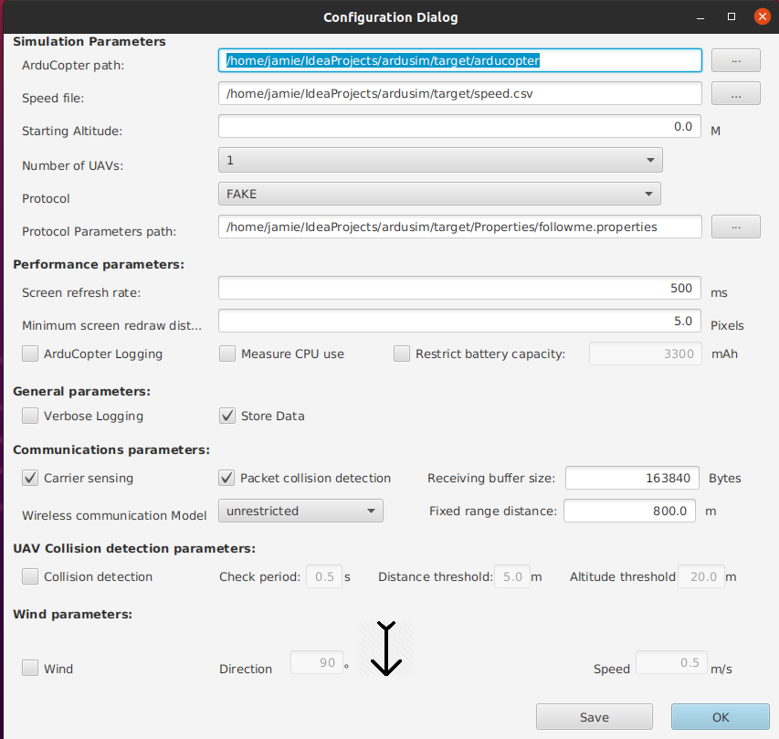
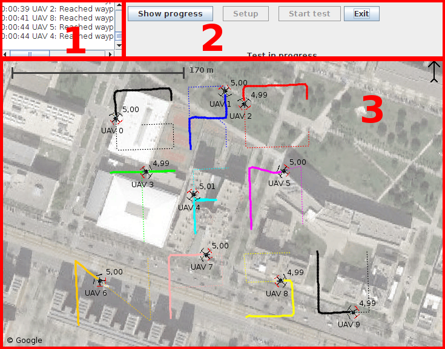

# ArduSim usage

We already explained that ArduSim can be used in two ways. First, it can be used to develop a new protocol, simulating the UAVs behavior for debugging until the protocol is ready to be deployed. Second, it can be used to deploy the new protocol in real multicopters, playing two roles; *UAV agent*, and *PC Companion*. The later helps to control the deployment from a laptop. This section explains in detail how to use ArduSim for simulation and for the deployment in real multicopters.

## Table of contents

[1 ArduSim on simulation](#markdown-header-1-ardusim-on-simulation)

[2 ArduSim on real multicopters](#markdown-header-2-ardusim-on-real-multicopters)

[3 INI configuration file](#markdown-header-3-ini-configuration-file)

## 1 ArduSim on simulation

A simulation can be performed directly in a IDE or from a *.jar* executable file. You need to run ArduSim with the parameter *simulator-gui* or *simulator-cli*. If you run ArduSim from an IDE you will need to set the parameter in the "run configuration".

The file *ardusim.ini* is used to load some relevant parameters both in simulation as in real UAVs. The default parameters for the *simulator-gui* are set in the *SimulationParam.properties* file.
While using the GUI version users can change several parameters, in the CLI version this is not possible and the *SimulationParam.properties* file should be updated (we recommend doing this via de GUI, using the save-button, to avoid any errors).
Furthermore, several main.java.com.api.protocols have an additional configuration dialog. Those parameters are also read from a file. This file is simular to *SimulationParm.properties* but is unique for each protocol for instance *main.java.com.protocols.muscop.properties*.
The developer of a protocol will have to create the GUI and CLI configuration dialog specific to his/her protocol and with it the *.properties* file. The *.properties* file is processed by a protocol specific class (we recommend the naming convention *protocolNameSimProperties.java*)
IMPORTANT NOTE: in the *protocolNameSimProperties.java* you will likely set more parameters then a user can change in the GUI, if this is the case, make sure to give them a default value.
If you forget to do this, and you run a real experiment the experiment will fail (or worst the UAV will crash) because those parameters have a null value! This is simple because all the *.properties* files are not read while doing real experiments only the *ardusim.ini* file is used in real experiments.

We suggest to run ArduSim as Administrator (on Windows, and requires Imdisk Virtual Disk Driver) or sudoer (Linux or MacOS). In this mode, temporary files are stored in a virtual hard drive, which speeds up ArduSim when using a slow HHDD, as it could limit the number of virtual multicopters that can be run simultaneously.

### 1.1 Simulation configuration

ArduSim starts showing the following dialog:

This dialog allows to introduce several simulation parameters:

* Simulation parameters:

    * *ArduCopter path*. The arducopter executable file is auto-detected if found in the same folder as ArduSim when running from a *.jar* file, or the root folder of the project when running in Eclipse IDE. In any other case, you need to manually locate the file.
    * *Speeds file*. The user must provide a *.csv* file with the maximum desired speed for the UAVs. One value per line/multicopter must be provided.
    * *Starting altitude*. Ground altitude of all the simulated UAVs for simulations. On a real UAV, the starting altitude is provided by the GPS.
    * *Number of UAVs*. The user can select the number of multicopters to be simulated depending on the number of speed values in the previous file, the performance of the computer, and the properties of the protocol being developed.

* Performance parameters:

    * *Screen refresh rate*. The UAVs and the path they are following are drawn on screen to analyze the behavior of the protocol under development. When running a large number of virtual UAVs, if the screen is updated frequently the performance of ArduSim can be affected.
    * *Minimum screen redraw distance*. Each time the multicopter moves on the screen a new line is also drawn between the previous and the current location of the UAV. The greater the number of lines to draw is, the CPU usage also increases, so increasing the length of the lines we reduce the CPU usage.
    * *Enable arducopter logging*. The firmware of the virtual flight controller can provide a binary log file that can be analyzed with tools like APM Planner 2.
    * *Restrict battery capacity*. By default, the battery capacity is almost infinite. The user can set a normal battery capacity to analyze the energy consumption produced by the protocol.
    * *Measure CPU usage*. If the behavior of the protocol is not the expected, or it includes complex calculus, it is possible that the CPU usage is too high to simulate a large amount of multicopters. Checking this option allows to log the CPU usage to a file for further analysis.
    * *Enable background map*. if selected, ArduSim tries to download a background map to show below the UAVs. At this moment, this option is useless, as Google has changed the Google Static Maps API policy and you need a paid Key to download images. It is planned to implement a workaround with Bing in the future, and the possibility of using Google Static Maps API with a valid key provided in the INI file.
    * *Rendering quality*. Four rendering quality levels have been analyzed in a [journal article](https://doi.org/10.1016/j.simpat.2018.06.009) about ArduSim, showing that they can be categorized in two groups attending the impact on the system performance. The levels *Maximum performance* and *Text smoothed* have lower impact than *Text and lines smoothed* and *Maximum quality*.

* General parameters:

    * *Enable verbose logging*. The user may use this option to show additional information in the main window log and console only under certain circumstances. For example, using this option ArduSim provides additional information for debugging purposes.
    * *Store Data*. Stores that data (in CLI-mode) and ,in GUI-mode, it gives the user the option to save the data.

* UAV synchronization protocol. This list is automatically populated with the main.java.com.api.protocols implemented in ArduSim. The user must select the protocol to be tested in simulation.

* UAV to UAV communications parameters:

    * *Enable carrier sensing*. When checked, this option forces to verify if the virtual media is busy before sending a new data packet.
    * *Enable packet collision detection*. Messages are discarded if this option is active and several are received at the same time on destination. 
    * *Receiving buffer size*. The default value is the UDP receiving buffer size in Raspbian, in a Raspberry Pi 3 B+.
    * *Wireless communications model*. Three propagation models have been implemented until now. *unrestricted* model allows data packets to arrive to destination always. *fixed range* model delivers packets only to UAVs that are at a distance lower than a certain threshold. Finally, *802.11a with 5dBi antenna* model has been implemented considering the communication link quality between two real multicopters (realistic model), where a packets reaches another UAV or not depending on the distance between sender and receiver.
    * *Fixed range distance*. If the second model is used, this option sets the range distance.

* UAV Collision detection parameters:

    * *Enable collision detection*. During simulation, ArduSim can check if two UAVs collide during the experiment.
    * *Check period*. It sets the period between two checks.
    * *Distance threshold*. This is the maximum distance between two virtual multicopters to assert that a collision has happened. It must not be close to zero, as current GPS have a significant error.
    * *Altitude difference threshold*. Similar to the previous option, this is the maximum altitude difference to assert that a collision has happened.

* Wind parameters:

    * *Enable wind*. Uniform wind can be simulated.
    * *Direction*. This parameter sets the direction of the wind in degrees.
    * *Speed*. This parameter sets the wind speed (m/s).

### 1.2 Protocol configuration

If the developer chooses to implement a dialog to input protocol parameters, it would open once the general configuration options are accepted. Otherwise, the main window of ArduSim is opened.

This dialog is the right place to set protocol parameters, and to load missions if needed by the protocol. You can load missions in two formats: QGroundControl *.txt* file and Google Earth *.kml* files. In the former case, there is one main.java.com.protocols.mission per file, but in the later case the same file can contain several missions. Follows a list of general rules:

* QGroundControl files:
    * The waypoint in the first line (0) is ignored and used for the current location, as usual on real multicopters.
    * The first real waypoint as provided by APM Planner 2 (second line, waypoint 1) must always be a takeoff command.
    * The following waypoints must be of type waypoint or spline waypoint. At this moment, ArduSim supports this two kind of waypoints through the main.java.com.protocols.mission.
    * The las waypoint can be of type waypoint, spline waypoint, land, or RTL. If the command is not of type land or RTL, the multicopter will remain flying over the last waypoint until the user takes control of it. Alternatively, the protocol implemented can force the UAV to land as in the protocol MBCAP, or it can also perform any other action just detecting when the UAV is close enough to the last waypoint.
* Google Earth file:
    * The user can add a land or RTL command at the end of the main.java.com.protocols.mission. Also, a hovering time over each waypoint can be set. If the hovering time is set to 0, the multicopter follows the normal behavior (cutting corners while passing through waypoints). This options are controlled with *MISSIONEND* and *WAYPOINTDELAY* parameters from *ardusim.ini* file, and can be modified through the GUI when running simulations.
    * If a waypoint has an altitude lower than the specified in the file *ardusim.ini*, it is set to that default for security reasons (when you create a *.kml* in Google Earth, by default the altitude is 0. The default altitude is applied if you don't modify that file manually to set new altitude values).

### 1.3 Main window

The following picture shows the main window of ArduSim with ten UAVs performing missions, represented as letters 'GRCTFMNPSU'.

On the upper left corner of the window (1) we can find the application log. It shows messages representing the result of commands sent to the UAVs, the progress of the experiment, and any desired information using functions `API.getGUI().log(String)`, `API.getGUI.logUAV(String)`, etc.

On the right (2), there are a few buttons that allow the user to control the experiment. The *Setup* button starts the actions included in the function `setupActionPerformed()` of the protocol implementation, as explained in section [Protocol development](development.md). On the other hand, the button *Start test* begins the experiment with the function `startExperimentActionPerformed()` of the implementation. The last button lets you to stop the experiment and exit ArduSim at any time, and the first one shows the following dialog, where up-to-date data from the multicopters is shown in real time: location, speed, flight mode, and specific information related to the protocol under test.

### 1.4 Results

When all the virtual multicopters land, the experiment ends. Then, the following dialog opens.

The provided data includes the time used by each multicopter during the experiment. This information is calculated considering that all the running multicopters start the flight sometime during the experiment.

The results include detailed statistics of the virtualized communications among the virtual UAVs and the configuration of the experiments, which enables to repeat the same experiment again. The developer can also include information relative to the protocol in the protocol initial dialog, detailing the corresponding parameters of the protocol implementation, as explained in section [Protocol development](development.md).

The user decides whether to store this information or not. In the former case, additional files are stored with many data about the experiment for further analysis. In the following list of files stored, *name* is the file name set by the user, and X is the UAV identifier.

* *name.txt*. It contains the same information shown in the results dialog.
* *name_mobility_OMNeT-INET-BoonMotionModel.txt*. The movement over the time (mobility) of all the UAVs is stored to be used in the communications simulator OMNeT++, using the mobility model *BoonMotionModel* of the INET framework.
* *name_mobility_OMNeT-INET-BoonMotionModel_3D.txt*. This file includes the same information plus the altitude of the multicopter over the time.
* *name_X_mobility_NS2.txt*. One file for each multicopter stores the mobility model to be used in the communications simulator NS2. This file format is compatible with NS3.
* *name_X_mobility_NS2_3D.txt*. In this case, the altitude of the multicopter is also included.
* *name_X_mission_AutoCAD.scr*. This file includes the simplified main.java.com.protocols.mission shown on screen, and it is stored in AutoCAD format as a single poliline.
* *name_X_mission_Google_Earth.kmz*. It includes the simplifed main.java.com.protocols.mission planned for all the UAVs, ready to be shown on Google Earth.
* *name_X_path_test.csv*. In this case, we include the 3D location, heading, speed, acceleration, and distance to origin over time. We think that this file may be the most useful to mathematically analyze the behavior of the multicopters.
* *name_X_path_setup.csv*. Same file, but incluiding the path followed during the setup phase. This file could be empty or not present at all if the UAV does nothing during the setup phase.
* *name_X_path_Google_Earth.kmz*. It includes the path followed by all the UAVs, ready to be shown on Google Earth.
* *name_X_path_AutoCAD.scr*. This is a simplified version of the previous file with an AutoCAD poliline with the path followed by the multicopter.
* *name_X_path_AutoCAD3d.scr*. This file includes a 3D poliline with the path followed by the multicopter.
* *name_CPU.txt*. This file is optionally stored for CPU usage analysis, and includes the global system CPU usage and the Java process CPU usage during each state of ArduSim execution. Two measures are provided; the global percentage, and the percentage relative to one core.
* *name_X_ArduCopter_log.BIN*. This file is also optionally stored and includes the binary logging of the virtual flight controller, when performing simulations. It can be used in software like APM Planner 2 for further analysis.

The user can generate additional files with the data gathered during the experiment, using the function *logData(String, String)* of the protocol implementation.

## 2 ArduSim on real multicopters

If a protocol is developed following the recommendations included with ArduSim, it can be easily deployed on real multicopters, just changing an execution parameter.

ArduSim can be executed with the following command line:

    java -jar ArduSim.jar <arg>

, with the argument:

* *simulator-gui*. ArduSim runs as a multi-UAV simulator in a computer with a graphical interface.
* *simulator-cli*. ArduSim runs as a multi-UAV simulator in a computer without a graphical interface.
* *multicopter*. ArduSim runs in a Raspberry Pi 3 B+ attached to the flight controller of a real multicopter.
* *com.api.pccompanion*. ArduSim runs as a PC Companion to coordinate the execution of a group of real multicopters, preferably in a laptop for mobility.

To deploy a protocol, ArduSim must be run in the real multicopters and in a computer, all connected in the same WiFi ad-hoc network. ArduSim will run as a PC Companion in the computer, which will control the experiment, sending the multicopters the required commands to setup and start the experiment.

### 2.1 Real multicopters

The command line must be:

    java -jar ArduSim.jar multicopter

A file named *ardusim.ini* must be in the same folder as *ArduSim.jar* in order to provide ArduSim the needed parameters, among others:

* The protocol to be launched.
* The desired flight speed for the multicopter.

An example of the *ardusim.ini* file is included in the root of the Eclipse project, and it is used when running ArduSim from Eclipse IDE.

First, ArduSim will wait until the multicopter is ready to fly. Then, it will accept the setup and start commands from the PC Companion. Messages are sent periodically to the PC Companion to inform the user if all the UAVs are ready to fly.

Of course, a protocol could start automatically without a PC Companion, but we recommend this method, as some UAVs could start the flight later than others.

### 2.2 PC Companion

The command line must be:

    java -jar ArduSim.jar com.api.pccompanion

The file *ardusim.ini* must be located beside *ArduSim.jar* to load parameters, and then the following windows opens:

The real UAVs periodically send data packets with their identifier, based on the MAC address, and the current simulation state.

In the example, just one multicopter has been detected and is ready to fly. From now, the setup button will be enabled and then the user will be able to send that command.

Once the setup process finishes, the user can also press the button "Start test" and the UAVs start the experiment.

Three buttons allow the user to recover control over the UAVs in case the protocol behavior is undesired:

* *Recover control*. The remote control of each multicopter must be turned on, and a pilot should be aware, as this command releases the control over the UAVs (RC channels override off) and they could crash.
* *RTL*. All the multicopters return to the location they were launched from.
* *Land*. In this case, the UAVs attempt to land wherever they are.

This PC Companion has been designed for a minimal interaction with the UAVs in order to reduce the media occupancy, as running a high number of real UAVs can collapse the WiFi channel. ArduSim stops sending messages between PC Companion and UAVs, and vice-versa once the experiment starts. Then, it opens an additional dialog if implemented by the developer. With that dialog, the user could supervise the behavior of the protocol, checking the data sent among the real UAVs.

### 2.3 Results

When the multicopter ends the experiment it must land. On simulation, the user had the option to store flight information or not, but in this case the data is always stored in the same folder where ArduSim is running once the multicopter lands. The Raspberry Pi is automatically shutdown to protect the microSD card.

## 3 INI configuration file

As explained before, a file *ardusim.ini* must be beside the ArduSim executable *.jar* file to provide parameters to the program. If not found, default parameters are used and the behavior of ArduSim could be different from desired.

The list of parameters is:

* Global parameters:
    * *MEASURECPU*. Measure CPU usage during the experiment.
    * *VERBOSELOGGING*. Verbose logging to ArduSim window and console.
    * *VERBOSESTORE*. Allows to store additional files at will.
    * *YAWOVERRIDE*. Allows to modify the yaw behavior while following a main.java.com.protocols.mission, with the next parameter value.
    * *YAWVALUE*. 0=Fixed, 1=Face next waypoint, 2=Face next waypoint except RTL, 3=Face along GPS course.
* KML files parameters:
    * *KMLMINALTITUDE*.Minimum relative altitude for any waypoint.
    * *KMLOVERRIDEALTITUDE*. Whether to override the altitude values included in the main.java.com.protocols.mission or not.
    * *KMLALTITUDE*. If the altitude values are overriden, the relative altitude for all of them.
    * *KMLMISSIONEND*. Whether to add a land or RTL command at the end of the main.java.com.protocols.mission. Valid values: unmodified, land, or RTL.
    * *KMLRTLENDALTITUDE*. Altitude where to stop the UAV when KMLMISSIONEND is assigned RTL value. If set to 0, it lands.
    * *KMLWAYPOINTDELAY*. Mission delay over each waypoint (seconds).
    * *KMLWAYPOINTDISTANCE*. Distance to waypoint to assert that it has been reached (centimeters), used only when WAYPOINTDELAY is greater than 0.
* PCCompanion-to-realUAV and realUAV-to-realUAV communication parameters:
    * *BROADCASTIP*. The IP must be the broadcast address of the network configured on the Raspberry Pi.
    * *BROADCASTPORT*. Port where the PC Companion can listen to supervise the protocol communications among real UAVs. The PC Companion can even interact with the multicopters with the functions "Copter.sendBroadcastMessage(byte[])" and "Copter.receiveMessage(int)".
    * *COMPUTERPORT*. Port where the PC Companion receives coordination messages from the UAVs.
    * *UAVPORT*. Port where the UAV receives coordination messages from the PC Companion.
* **MANDATORY** parameters when running in real UAVs:
    * *UAVPROTOCOL*. Protocol to be deployed.
    * *UAVSPEED*. Maximum planned speed of the multicopter.
* Optional parameter for main.java.com.api.protocols that use the master-slave pattern.
    * *MACS*. MAC addresses of the adapters of the master UAV (colon notation, and comma separated). This parameter is only used on real UAVs.
    * *TAKEOFFALGORITHM*. Safety strategy used for a safe takeoff (Optimal, Simplified, or Random). Optimal used an NP-hard solution that any hardware is able to solve, so it should only be used for simulations, and with a reduced number of UAVs, tipically less than 13. Simplified proposes a safe takeoff strategy that avoids collisions, and that can be calculated in limited hardware in an acceptable amount of time. Finally, Random provides a random definition to the takeoff sequence, so NEVER use in on real UAVs or they could collide durint takeoff!!!
* Optional parameters for main.java.com.api.protocols that use flight formations:
    * *AIRFORMATION*. UAV flying formation. Used to set the flying layout.
    * *AIRDISTANCE*. Minimum distance between contiguous UAVs in the flying formation. It must be an integer value in meters.
    * *LANDDISTANCE*. Minimum distance between contiguous UAVs for the landing phase.
* Optional parameters when running in real UAVs:
    * *SERIALPORT*. Raspberry Pi serial port the flight controller is connected to.
    * *BAUDRATE*. Baud rate of the serial link.
    * *BATTERYCELLS*. Number of cells of the LiPo battery.
    * *BATTERYCAPACITY*. Battery capacity (mAh).
* Optional simulation parameters:
	* *BINGKEY*. Bing key used to show aerial, hybrid, or street maps from Microsoft Bing. You can get a free key using your Microsoft account.